# CHHAYA_V1_MASTER_ARCHITECTURE.md

**Document Title:** Chhaya AI Operating System – Master Architecture Specification
**Version:** 1.0 Draft
**Status:** Architecture Freeze Candidate
**Classification:** Internal – Engineering
**Last Updated:** 2026-07-12

---

## DOCUMENT OBJECTIVE

This document defines the complete architecture of the Chhaya AI Operating System. It describes the structural organization, subsystem boundaries, interaction patterns, technology integration strategy, and governing principles. The specification serves as the constitutional reference for all engineering decisions, design reviews, and implementation activities. It does **not** contain source code, implementation steps, sprint plans, prompts, or speculative features.

All existing kernel components are **immutable architectural foundations**. Every future subsystem extends or integrates with the kernel without modifying its internals.

---

## TABLE OF CONTENTS

1. Vision and Mission
2. Architectural Philosophy
3. Design Principles
4. High-Level System Overview
5. Layered Architecture
6. Kernel Architecture
7. Cognitive Layer Architecture
8. Knowledge Layer Architecture
9. Capability Layer Architecture
10. Infrastructure Layer Architecture
11. Communication Architecture
12. Event Architecture
13. Data Flow Architecture
14. Configuration Architecture
15. Security Architecture
16. Plugin Architecture
17. Deployment Architecture
18. Package Organization
19. OSS Integration Strategy
20. Non-Functional Requirements
21. Scalability Strategy
22. Reliability Strategy
23. Extensibility Strategy
24. Architecture Constraints
25. Architecture Summary
26. AI Operating System Execution Lifecycle
27. Agent Hierarchy Architecture
28. Operating System State Machine
29. Capability Discovery Architecture
  29.1 Discovery Pipeline
  29.2 Runtime Discovery Sequence
  29.3 Capability Lifecycle Management & Sandboxing
30. Model Routing Strategy
31. Memory Hierarchy
32. Context Assembly Pipeline
33. Error Recovery Architecture
  33.1 Error Categories and Responses
  33.2 Recovery Patterns
  33.5 Observability Pipeline & Health Check Architecture
34. Learning Feedback Loop
35. Internal Package Dependency Rules
36. Additional Architectural Policies
  36.1 Boot Sequence
  36.2 Event Naming Standard
  36.3 Configuration Hierarchy
  36.4 Plugin Compatibility Policy
  36.5 Architecture Evolution Policy
  36.6 Upgrade & Migration Strategy
  36.7 Architecture Fitness Functions
Appendix A – Architecture Review Notes

---

## 1. VISION AND MISSION

**Vision**
To provide a local-first, modular AI operating system that evolves into a highly trusted, Jarvis/Friday-class cognitive assistant, capable of reasoning, planning, and acting on behalf of users while preserving absolute privacy and user sovereignty.

**Mission**
Deliver a production‑ready architectural foundation where every intelligent behaviour is composed from loosely coupled, event‑driven, and interface‑first components, enabling continuous evolution without architectural erosion.

---

## 2. ARCHITECTURAL PHILOSOPHY

Chhaya is built on the conviction that an AI operating system must be as disciplined as a database kernel or an embedded real‑time OS. The architecture treats AI capabilities as first‑class subsystems within a classical layered and event‑driven design, not as ad‑hoc scripts or model‑calling pipelines.

Philosophical tenets:
- **Local sovereignty** – all data, reasoning, and state reside on the user’s device by default.
- **Separation of mechanism and policy** – kernel provides mechanisms; higher layers define policies.
- **Plug‑and‑play intelligence** – cognitive engines, knowledge stores, and tools are replaceable through stable interfaces.
- **Deterministic composition** – event flows are explicitly designed for exact‑once semantics and strict ordering where required.
- **Immutable core** – the kernel API and behaviour are frozen; extension happens through adapters, decorators, and providers.

---

## 3. DESIGN PRINCIPLES

The following principles are non‑negotiable and validated in every architectural decision.

| Principle | Description |
|-----------|-------------|
| Local‑first | System operates fully offline; cloud services are optional and isolated behind adapters. |
| Modular | Every subsystem is a self‑contained package with well‑defined public interfaces. |
| Event‑driven | Communication between subsystems uses the Event Bus; direct synchronous calls are minimised. |
| Clean Architecture | Dependencies point inward; kernel has zero knowledge of outer layers. |
| SOLID | Single responsibility, open/closed, Liskov, interface segregation, dependency inversion enforced. |
| Dependency Injection | All component wiring is performed by the kernel DI container. |
| Interface‑first | Every service and plugin is defined by an abstract interface before any implementation. |
| Adapter Pattern | All third‑party frameworks are accessed through interfaces and adapters in the Infrastructure layer. |
| Async‑first | All I/O and long‑running operations use asynchronous primitives; blocking calls are isolated. |
| Configuration‑driven | Behaviour is governed by declarative configuration, never hard‑coded. |
| Plugin‑friendly | Capabilities and extensions are discovered and loaded via the Provider Registry without kernel recompilation. |
| Exact‑once publishing | The Event Bus guarantees that each event is published and delivered exactly once within the system boundary. |
| No circular dependencies | Package dependency graphs are directed acyclic. |
| OSS isolation | Open‑source frameworks never appear in kernel or domain layer code; all are wrapped in Infrastructure adapters. |

---

## 4. HIGH-LEVEL SYSTEM OVERVIEW

Chhaya is a collection of cooperating subsystems organised in six architectural layers. Users interact through interface surfaces (API, desktop, mobile). Requests flow through the Cognitive Layer for understanding and planning, the Knowledge Layer for contextual retrieval, and the Capability Layer for executing tools and automations. The Kernel provides the underlying execution fabric, while Infrastructure supplies cross‑cutting services.

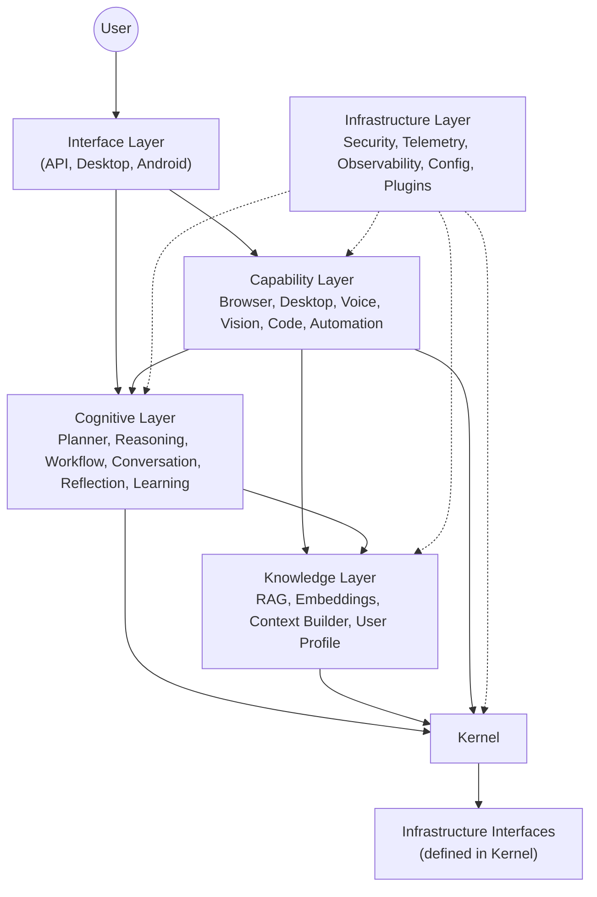

---

5. LAYERED ARCHITECTURE

The system is partitioned into six layers with strict upward dependency rules. Each layer may only depend on layers below it and on interfaces defined in the Kernel.

Layer Responsibility Examples
Interface Expose system services to users and external systems API Server, Desktop App, Android App
Capability Execute actions in the digital and physical world Browser, Desktop automation, Voice I/O, Code Executor
Cognitive Understand intent, plan, reason, and maintain dialogue Model Router, Planner, Workflow Engine, Reflection
Knowledge Store, retrieve, and contextualise information RAG, Embeddings, Knowledge Graph, User Profile
Infrastructure Cross‑cutting technical services with adapters to OSS Security, Telemetry, Observability, Plugin Loader
Kernel Immutable execution core; zero external dependencies DI Container, Event Bus, State Manager, Scheduler, Agent Runtime

```mermaid
block-beta
    columns 1
    block:Layers
        A["Interface Layer"]
        B["Capability Layer"]
        C["Cognitive Layer"]
        D["Knowledge Layer"]
        E["Infrastructure Layer"]
        F["Kernel"]
    end
    E --> F: interfaces only
    D --> F
    C --> D
    C --> F
    B --> C
    B --> F
    A --> B
```

The Infrastructure layer is shown as a vertical pillar that provides adapters and cross‑cutting implementations to all layers, but itself depends only on interfaces exported by the Kernel.

---

6. KERNEL ARCHITECTURE

The kernel is the system’s immutable foundation. It contains the minimal set of services required to build and orchestrate all higher‑level behaviours.

6.1 Kernel Subsystems

Subsystem Responsibility Internal Dependencies
DI Container Manage component lifecycle and wiring; resolve interface‑implementation mappings. None
Event Bus Enable publish‑subscribe communication with exact‑once semantics; support ordered delivery. DI Container
State Manager Maintain transactional, versioned system state; support event‑sourcing and snapshots. Event Bus
Provider Registry Register and discover plugins and capability providers at runtime. DI Container
Capability Registry Map capability interfaces to concrete implementations and enforce capability contracts. Provider Registry, DI Container
Task Scheduler Schedule and manage asynchronous, durable, and recurring tasks. DI Container, Event Bus
Agent Runtime Instantiate agent processes, manage lifecycle, and coordinate planning‑execution loops. Task Scheduler, Capability Registry, Event Bus
Capability Execution Engine Execute a requested capability through its registered adapter, enforcing isolation and timeouts. Capability Registry, State Manager
Memory Engine Provide low‑level persistence abstractions for key‑value, vector, and graph stores. DI Container

All kernel components communicate exclusively through the Event Bus and DI‑injected interfaces. No kernel component references any file system, network, or third‑party library directly.

6.2 Kernel Dependency Graph

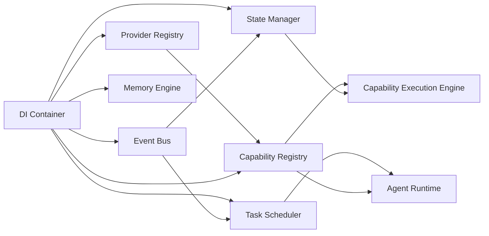

---

7. COGNITIVE LAYER ARCHITECTURE

The Cognitive Layer implements the system’s “thinking” capabilities. It is responsible for interpreting natural language, decomposing goals into executable plans, and maintaining coherent multi‑turn conversations. All model access is abstracted behind the Model Router.

7.1 Subsystems

Subsystem Responsibility Depends On
Model Router Select optimal language model based on task, cost, and latency; manage fallback chains. IModelAdapter (Kernel interface, resolved via DI)
Prompt Engine Construct and optimise prompts from templates, context, and conversation state. Knowledge (Context Builder)
Planner Decompose user intent into a directed acyclic graph of steps using LangGraph workflows. Model Router, Knowledge Layer
Reasoning Execute multi‑step logical inference, chain‑of‑thought, and verification loops. Model Router
Workflow Manage the execution of plan steps, handle branching and parallelism. Kernel (Task Scheduler)
Conversation Maintain dialogue state, threading, and turn management. Kernel (State Manager)
Reflection Analyse completed tasks and conversations to generate self‑critique and improvement signals. Knowledge (User Profile)
Learning Update user model and long‑term memory from interactions under privacy constraints. Knowledge (Knowledge Engine)

The Cognitive Layer never communicates directly with external APIs. All LLM calls go through the Model Router, which delegates to the IModelAdapter implementation provided by Infrastructure via DI.

---

8. KNOWLEDGE LAYER ARCHITECTURE

The Knowledge Layer transforms raw data into retrievable, contextual knowledge. It owns the ingestion pipeline, indexing strategies, and query‑time context assembly.

8.1 Subsystems

Subsystem Responsibility Depends On
Knowledge Engine Orchestrate knowledge ingestion, chunking, and indexing. IIndexingPipeline, IVectorStore (Kernel interfaces)
RAG Perform retrieval‑augmented generation by fusing vector search with structured knowledge. Embeddings, Knowledge Engine
Embeddings Generate, store, and update vector representations of textual and multimodal data. IEmbeddingModel (Kernel interface)
Context Builder Assemble a minimal, high‑signal context window from current task, user profile, and retrieved chunks. RAG, User Profile
User Profile Maintain a structured, privacy‑sensitive model of user preferences, routines, and knowledge state. State Manager (Kernel)

All vector storage backends (e.g., Qdrant) are accessed through the IVectorStore interface defined in the Kernel, with an adapter in Infrastructure. Retrieval and generation responsibilities are cleanly separated; any fusion requiring an LLM call occurs in the Cognitive layer.

---

9. CAPABILITY LAYER ARCHITECTURE

The Capability Layer provides concrete tools that act on the user’s digital and physical environment. Every capability is a plugin that implements a standard capability interface.

9.1 Subsystems

Subsystem Responsibility OSS Integration
Browser Automate web interactions, scraping, and form filling. Playwright, Browser Use (behind IBrowserDriver)
Desktop Control desktop applications, file system, and window management. Tauri native APIs (behind IDesktopAutomation)
Voice Speech‑to‑text and text‑to‑speech. Faster‑Whisper (STT), Piper (TTS) (behind ISpeechIO)
Vision Screen understanding, OCR, and image analysis. Vision model adapters (behind IVisionService)
Code Execution Safely run user‑supplied or AI‑generated code in sandboxed environments. OpenHands (behind ICodeExecutor)
Automation Compose multiple capabilities into high‑level automations and macros. Kernel (Workflow via Cognitive)

Each capability registers itself with the Capability Registry and is invoked exclusively through the Capability Execution Engine, which enforces permissions and resource limits.

---

10. INFRASTRUCTURE LAYER ARCHITECTURE

The Infrastructure layer provides technical services that are neither part of the core domain nor the kernel. It implements all adapters to external frameworks.

10.1 Subsystems

Subsystem Responsibility Adapter Interface (Kernel)
Security Authentication, authorization, and audit logging. IAuthorizationService (Casbin adapter)
Permission Manager Manage fine‑grained capability access and user consent. IPermissionStore, IConsentManager
Telemetry Collect traces, metrics, and logs without exposing framework types. ITelemetrySink (OpenTelemetry adapter)
Observability Provide LLM‑specific tracing and evaluation dashboards. IObservabilityBackend (Langfuse adapter)
Configuration Load, validate, and merge YAML/JSON configuration from multiple sources. IConfigurationProvider
Plugin System Dynamic discovery, lifecycle, and isolation of plugin assemblies. Kernel Provider Registry
API Server Expose REST/WebSocket endpoints for external clients. FastAPI (behind IHttpServer)
Desktop App Native desktop shell using Tauri. Tauri shell loads the core logic as a library
Android App Mobile interface rendered via Flutter. Flutter app communicates with API Server

Infrastructure adapters are the only places where OSS framework types appear. The kernel and domain layers remain completely framework‑free.

---

11. COMMUNICATION ARCHITECTURE

All inter‑subsystem communication is message‑oriented. Synchronous request‑response is permitted only at the Interface Layer boundary and for short‑lived queries that require immediate answers (e.g., permission checks). All other interactions are asynchronous events.

Communication patterns:

· Commands – intent to change state, delivered via Event Bus with exact‑once guarantee.
· Events – notification of something that happened, immutable and idempotent.
· Queries – direct interface method calls to read‑optimised projections, never mutate state.

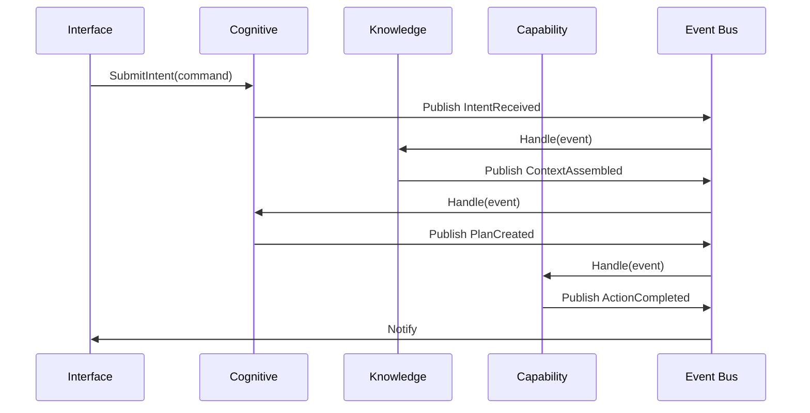

---

12. EVENT ARCHITECTURE

The Event Bus is the central nervous system. It guarantees exactly‑once delivery through a combination of transactional outbox and idempotent consumer patterns.

Key design decisions:

· Every event carries a unique, deterministic event ID (ULID).
· Consumers persist the last processed event ID to skip duplicates.
· The bus supports ordered delivery per aggregate stream.
· Events are persisted in an event store managed by the State Manager for replay and audit.

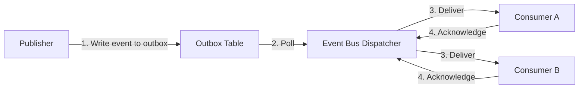

All events follow a strict schema versioning policy.

---

13. DATA FLOW ARCHITECTURE

Request Lifecycle (e.g., user asks “find and summarise the latest paper on X”)

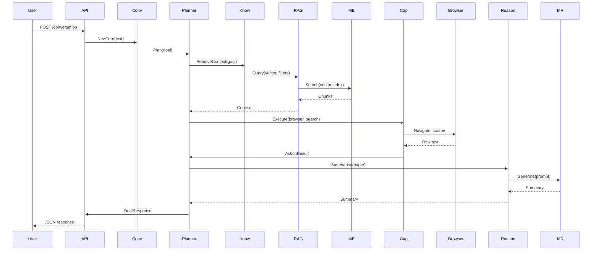

Memory Flow

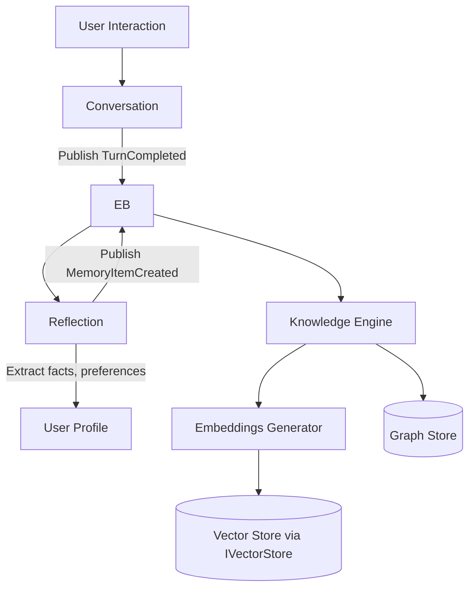

---

14. CONFIGURATION ARCHITECTURE

Configuration is fully externalised and hierarchical. The system merges configuration from:

1. Built‑in defaults (hardened base)
2. User profile directory (user overrides)
3. Plugin‑supplied configuration schemas

All subsystems read their configuration through IConfigurationProvider and never access files or environment variables directly. The configuration system supports versioned schemas and automatic migration.

---

15. SECURITY ARCHITECTURE

Security is enforced at the Capability Execution Engine boundary. Every capability invocation is intercepted by the Permission Manager, which evaluates policies defined in Casbin models. The authorization model is attribute‑based (ABAC), enriched with user consent records.

Components:

· Security Context – immutable object containing user identity, session, and request metadata, propagated through the entire call chain.
· Permission Manager – authorises capability access; denies by default.
· Audit Log – all security‑relevant events are written to the event store and forwarded to telemetry.

Local‑first ensures that all private data remains on‑device. Any remote communication is opt‑in and strictly bounded by adapters.

---

16. PLUGIN ARCHITECTURE

Plugins are dynamically loaded assemblies that register one or more capability or service implementations with the Provider Registry. A plugin must:

· Implement a well‑known interface (e.g., IBrowserDriver).
· Declare a manifest with version, permissions, and configuration schema.
· Be loaded into an isolated context with resource limits.

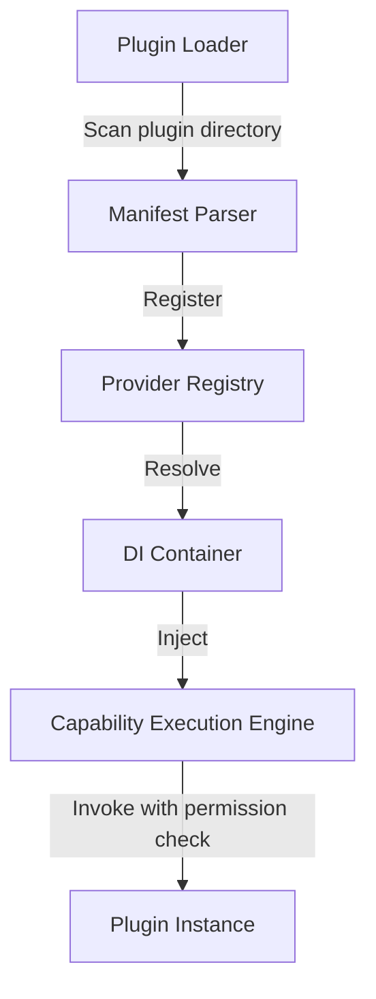

The plugin system is entirely kernel‑mediated; plugins never communicate directly with each other except through the Event Bus.

---

17. DEPLOYMENT ARCHITECTURE

Chhaya is deployed as a single local process with optional auxiliary services.

· Desktop deployment: The core logic runs as a background service inside the Tauri shell. The desktop app communicates over local IPC.
· Mobile deployment: An API Server (FastAPI) runs on‑device, and the Flutter app interacts via localhost HTTP/WebSocket.
· Developer deployment: The API Server can be exposed on a local network for headless operation.
· Cloud‑augmented mode (optional): An instance of Temporal can be configured to outsource durable task scheduling; the adapter swaps in seamlessly.

All components are packaged as standard OS packages (Linux .deb, macOS .app, Windows .msi, Android .apk).

---

18. PACKAGE ORGANIZATION

```
chhaya/
|── kernel/                  # Immutable kernel (zero external deps)
|   |── di/
|   |── events/
|   |── state/
|   |── providers/
|   |── capabilities/
|   |── scheduler/
|   |── runtime/
|   \_── memory/
|── infrastructure/          # Adapters and technical services
|   |── adapters/            # OSS wrappers (LiteLLM, Qdrant, ...)
|   |── security/
|   |── telemetry/
|   |── config/
|   \_── plugins/
|── cognitive/               # AI reasoning and dialogue
|   |── router/
|   |── planner/
|   |── reasoning/
|   |── workflow/
|   |── conversation/
|   \_── reflection/
|── knowledge/               # Retrieval and memory
|   |── engine/
|   |── rag/
|   |── embeddings/
|   |── context/
|   \_── profile/
|── capabilities/            # Tool implementations
|   |── browser/
|   |── desktop/
|   |── voice/
|   |── vision/
|   \_── code/
|── interfaces/              # Public API and DTOs
|   |── api/
|   |── desktop/
|   \_── mobile/
\_── tests/                   # Architecture and integration tests
```

Package Ownership Table

Package Owner Layer Key Contents
kernel Kernel DI, EventBus, StateManager, Scheduler, AgentRuntime, MemoryEngine
infrastructure Infrastructure All OSS adapters, security, telemetry, plugin loader
cognitive Cognitive ModelRouter, Planner, Workflow, Reflection
knowledge Knowledge RAG, Embeddings, ContextBuilder, UserProfile
capabilities Capability Browser, Desktop, Voice, Vision, CodeExecutor
interfaces Interface FastAPI server, Tauri shell, Flutter app

---

19. OSS INTEGRATION STRATEGY

All open‑source projects are isolated behind stable interfaces. The following table documents the mapping.

OSS Technology Architectural Role Adapter Interface (Kernel) Adapter Package
LiteLLM Multi‑model LLM access IModelAdapter infrastructure/adapters/litellm
LangGraph Graph‑based planning & workflows IPlanner, IWorkflowEngine infrastructure/adapters/langgraph
Temporal Durable, distributed task execution (optional) ITaskScheduler (alternative impl) infrastructure/adapters/temporal
LlamaIndex RAG ingestion and retrieval pipelines IIndexingPipeline infrastructure/adapters/llamaindex
Qdrant Vector similarity search IVectorStore infrastructure/adapters/qdrant
Browser Use / Playwright Web automation IBrowserDriver infrastructure/adapters/browser
Faster‑Whisper Local speech‑to‑text ISpeechToText infrastructure/adapters/voice
Piper Local text‑to‑speech ITextToSpeech infrastructure/adapters/voice
OpenTelemetry Distributed tracing & metrics ITelemetrySink infrastructure/telemetry
Langfuse LLM observability & tracing IObservabilityBackend infrastructure/observability
Casbin Authorization policy engine IAuthorizationService infrastructure/security
Tauri Native desktop shell No adapter needed; shell hosts core interfaces/desktop
Flutter Cross‑platform mobile UI No adapter needed; communicates with API interfaces/mobile
FastAPI HTTP API framework IHttpServer interfaces/api
OpenHands Sandboxed code execution ICodeExecutor infrastructure/adapters/code

Build vs. Integrate Matrix (excerpt)

Component Decision Justification
Kernel (all) Build Core IP; zero external dependencies essential for stability.
Model Router logic Build Thin orchestration; uses LiteLLM adapter.
RAG pipeline composition Build Custom orchestration around LlamaIndex.
Permission Manager Build Thin wrapper; delegates to Casbin adapter.
Vector Store Integrate (Qdrant) High‑performance vector search is commodity; adapter ensures swapability.
Speech I/O Integrate (Whisper/Piper) Mature local models; adapter decouples from concrete implementations.

---

20. NON-FUNCTIONAL REQUIREMENTS

Category Requirement Validation Mechanism
Performance Intent‑to‑first‑token latency < 500 ms for local models. Telemetry dashboards
Availability Core loop continues offline; optional cloud features degrade gracefully. Chaos testing
Privacy No user data leaves device without explicit, auditable consent. Architecture compliance review
Security All capabilities are gated by ABAC; audit log immutably stored. Penetration testing
Extensibility New capability plugin must be addable without kernel recompilation. Automated plugin integration test
Configurability All model parameters, retrieval strategies, and policies are configurable at runtime. Configuration migration tests
Maintainability Strict layer boundaries; dependency violations prevented by architecture fitness functions. Static analysis (ArchUnit‑style)
Portability Core runs on Linux, macOS, Windows, Android (via API server on‑device). CI pipeline on all platforms

---

21. SCALABILITY STRATEGY

Chhaya is primarily a single‑user, local‑first system. Scalability concerns arise from:

· Local resource efficiency – models and vector stores must operate within consumer hardware bounds. The Model Router selects quantised models and can offload to cloud adapters if user‑permitted.
· Multi‑agent concurrency – the Agent Runtime can manage multiple agent instances within the same process. The Task Scheduler limits parallelism based on available cores.
· Optional distributed mode – the Temporal adapter enables distributing scheduled tasks across a cluster for use cases like enterprise RPA. This mode is entirely transparent to the core architecture.

---

22. RELIABILITY STRATEGY

· State persistence – the State Manager uses an append‑only event store with snapshotting. Crashes are recovered by replaying events.
· Idempotent processing – every event handler is idempotent; duplicate deliveries are harmless.
· Graceful degradation – if an external adapter fails (e.g., Qdrant unreachable), the system falls back to an in‑memory store and raises a telemetry alert.
· Circuit breakers – all adapter calls are protected by circuit breakers to prevent cascade failures.

---

23. EXTENSIBILITY STRATEGY

Extensibility is achieved through stable interfaces and the Provider Registry, without modifying existing code.

· New capability – implement ICapability, provide a manifest, drop into plugin directory.
· New model provider – implement IModelBackend and register with Model Router.
· New knowledge store – implement IVectorStore and configure.
· Workflow customisation – planners can be swapped by registering a different IPlanner implementation.

The architecture forces extensions to conform to the same event‑driven, interface‑first discipline, preventing architectural drift.

---

24. ARCHITECTURE CONSTRAINTS

1. The kernel package must compile without any external dependency beyond the language standard library.
2. No layer above Kernel may bypass the Event Bus for state‑changing operations; queries may use direct interfaces if read‑only.
3. All plugin loading occurs via the Provider Registry; no reflection‑based discovery outside it.
4. Every OSS framework must be entirely hidden behind an interface defined in Kernel or a domain layer.
5. Configuration schema changes require a version increment and a migration path.
6. All event schemas are backwards‑compatible using a well‑defined versioning strategy.
7. No synchronous network calls are permitted in the Cognitive reasoning hot path; all external calls are asynchronous and cancellable.

---

25. ARCHITECTURE SUMMARY

Chhaya’s architecture is a carefully layered, event‑driven, local‑first AI operating system built on an immutable kernel. It cleanly separates cognition, knowledge, and action into independent subsystems that communicate through exact‑once events and dependency‑injected interfaces. All external AI and infrastructure frameworks are isolated behind adapters, ensuring the system can evolve without lock‑in. The specification provides a blueprint for an enterprise‑grade, production‑ready assistant that is trustworthy, extensible, and sovereign by design.

---

26. AI OPERATING SYSTEM EXECUTION LIFECYCLE

The execution lifecycle defines the complete, end‑to‑end processing path of a user request, from initial intake to final response and system learning. It represents the operational “heartbeat” of Chhaya and binds every subsystem into a coherent, repeatable pattern. All communication within the lifecycle is event‑driven, asynchronous where latency permits, and strictly mediated by the Kernel.

26.1 Lifecycle Steps

1. User Request – A natural language command, gesture, or trigger enters the system through an Interface (API, Desktop, or Mobile).
2. Conversation Engine – The request is attached to an active conversation thread. The Conversation engine resolves intent context, manages turn state, and emits an INTENT.RECEIVED event.
3. Planner – The Planner decomposes the intent into a directed acyclic plan graph. It identifies required knowledge, capabilities, and sequencing constraints.
4. Knowledge Retrieval – The Planner requests relevant context. The Knowledge Layer queries vector, graph, and profile stores to gather supporting information.
5. Context Builder – Retrieved knowledge is assembled, filtered, and ranked according to token budget and relevance. The result is a compact context payload.
6. Prompt Engine – The Prompt Engine merges the plan, context, conversation history, and persona rules into a model‑agnostic prompt template.
7. Model Router – The Model Router selects the optimal language or foundation model based on task type, latency budget, hardware profile, and privacy requirements.
8. Reasoning – The chosen model performs chain‑of‑thought or instructed reasoning, producing structured output (facts, decisions, next steps).
9. Workflow Engine – The output is interpreted as workflow operations. The Workflow Engine activates the required plan nodes, managing parallel branches and condition checks.
10. Capability Execution – For each action node, the Capability Execution Engine invokes the appropriate tool (browser, code, desktop) through the Capability Registry, enforcing permission and resource limits.
11. Reflection – After a capability completes, the Reflection subsystem evaluates the outcome against expectations, detects anomalies, and generates an improvement signal.
12. Learning – Based on reflection, the Learning subsystem updates user profile attributes, stores procedural insights, and adjusts long‑term memory embeddings.
13. Memory Update – Working memory, conversation memory, and short‑term buffers are updated. Relevant facts are persisted into long‑term stores via the Memory Engine.
14. Response Generation – A final model call (or direct template) produces the user‑facing response, which is rendered by the Interface.

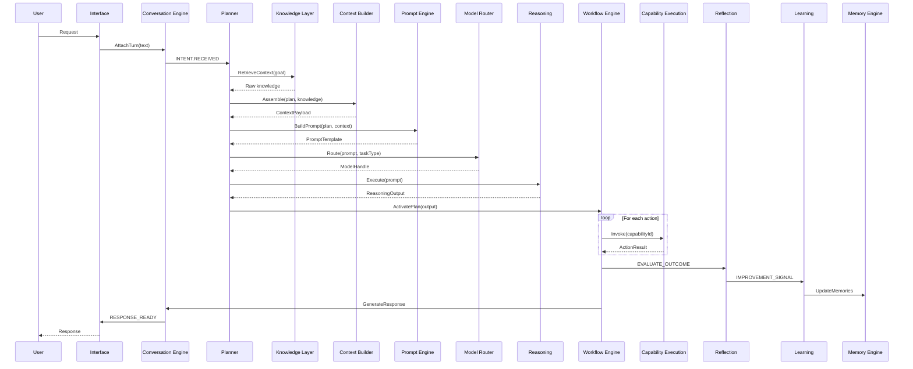

---

27. AGENT HIERARCHY ARCHITECTURE

Chhaya supports a multi‑agent architecture in which specialised agents are orchestrated by a Supervisor Agent. All agents are instantiated by the Agent Runtime and communicate exclusively through the Event Bus and dependency‑injected interfaces. This hierarchy is designed for future expansion; the kernel remains unchanged regardless of the number of agents.

27.1 Agent Responsibilities

Agent Responsibility Key Interfaces
Supervisor Agent Coordinates top‑level goals, delegates to child agents, resolves conflicts, and enforces global policies. ISupervisorPolicy, IAgentDirectory
Planner Agent Decomposes supervisor goals into executable plans. Invokes the Planner subsystem. IPlanner
Conversation Agent Manages dialogue state, turn‑taking, and multi‑modal input synthesis. IConversationManager
Research Agent Performs deep information retrieval, web searches, and summarisation. Uses RAG and Browser agents. IResearcher
Browser Agent Controls a headless or visible browser for web automation. IBrowserDriver
Vision Agent Processes screen captures, images, and OCR. IVisionService
Voice Agent Handles speech‑to‑text and text‑to‑speech. ISpeechIO
Automation Agent Executes desktop automation scripts and macros. IDesktopAutomation
Coding Agent Writes, reviews, and runs code in sandboxed environments. ICodeExecutor
Reflection Agent Continuously analyses agent outputs and flags anomalies. IReflectionEngine
Learning Agent Aggregates feedback and updates user and knowledge models. ILearningPipeline

27.2 Coordination and Lifecycle

· Agents subscribe to event topics relevant to their domain.
· The Supervisor Agent publishes GOAL.SUBMITTED; child agents respond with PLAN.PROPOSED, ACTION.COMPLETED, etc.
· Lifecycle management (start, pause, stop) is performed by the Agent Runtime, which monitors heartbeats.
· Agents are stateless except for conversation‑scoped context; all persistent state is held in the State Manager or Memory Engine.
· Communication is strictly message‑based; no direct method calls between agents.

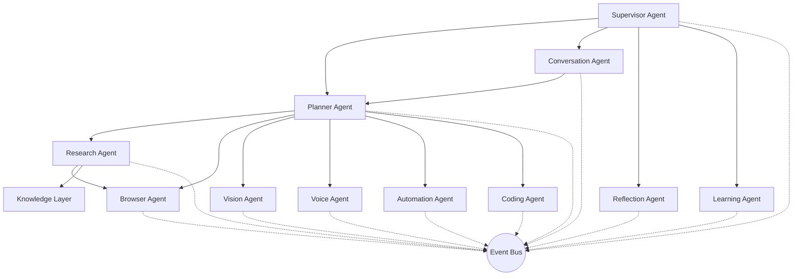

---

28. OPERATING SYSTEM STATE MACHINE

Chhaya’s lifecycle is governed by a finite state machine that ensures orderly startup, operation, error handling, and shutdown. The Agent Runtime manages state transitions in response to internal events and user commands.

28.1 States

State Description
BOOT System process started; minimal environment available.
INITIALIZATION Core subsystems loaded; DI container, Event Bus, State Manager initialised.
CONFIG_LOADING Configuration files read and merged.
PLUGIN_LOADING Plugin manifests scanned, validated, and capabilities registered.
READY All kernel and infrastructure services online; awaiting user input.
IDLE No active request; system may run background tasks (garbage collection, model warming).
LISTENING Active conversation turn started; speech or text being captured.
PLANNING Planner decomposes intent into plan graph.
REASONING Model inference in progress.
EXECUTING Capability execution (browser, code, etc.) underway.
WAITING System waiting for external async result (e.g., long‑running code execution).
LEARNING Post‑execution reflection and memory update occurring.
ERROR_RECOVERY An error triggered a recovery procedure (retry, fallback).
SHUTDOWN Graceful teardown of all subsystems.

28.2 State Transitions

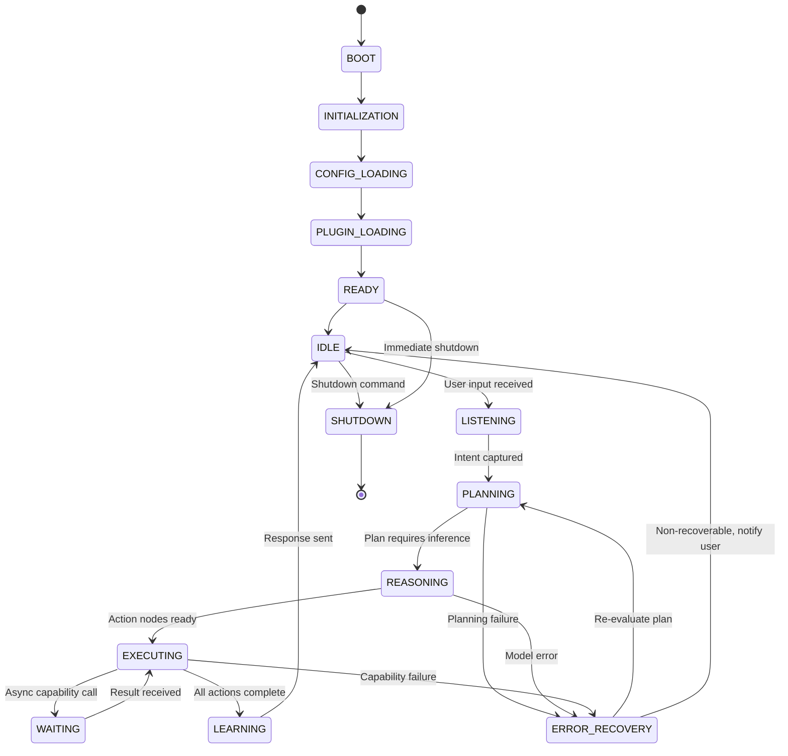

All state changes are published as SYSTEM.STATE.CHANGED events with the previous and current states, enabling telemetry and audit.

---

29. CAPABILITY DISCOVERY ARCHITECTURE

Capability discovery is the process by which new plugins become executable actions available to the system. The architecture ensures that every capability is validated, authorised, and registered without modifying the kernel or restarting the entire system.

29.1 Discovery Pipeline

1. Plugin Deposition – A plugin artefact (e.g., .zip or directory) is placed in the designated plugin directory.
2. Manifest Parsing – The Plugin Loader reads the plugin manifest (manifest.yaml), which declares the capability interface it implements, version, permissions required, and configuration schema.
3. Validation – The manifest is validated against the plugin schema; signatures are verified if present. Invalid manifests are rejected with a telemetry event.
4. Permission Verification – The Permission Manager checks whether the plugin’s requested permissions are compatible with the user’s consent policy. Plugins requiring unauthorised scopes are blocked and logged.
5. Provider Registration – The validated plugin assembly is loaded into an isolated context, and its public implementation is registered with the Provider Registry as an implementation of a kernel‑defined interface (e.g., IBrowserDriver).
6. Capability Registration – The Capability Registry maps the interface to a unique capability ID and attaches the required permission set, default configuration, and metadata.
7. Dependency Injection Wiring – The DI Container binds the capability ID to the registered implementation. Higher‑layer services (e.g., Planner) request capabilities by ID through the ICapabilityResolver.
8. Availability – The new capability appears in the list of executable actions; the Agent Runtime can now invoke it through the Capability Execution Engine.

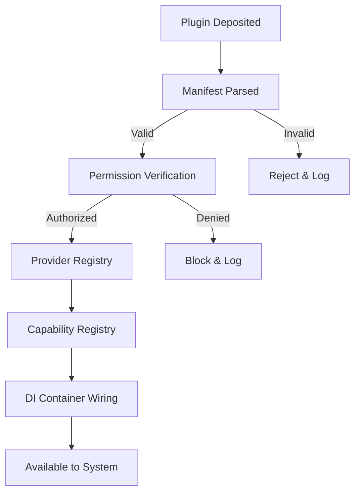

29.2 Runtime Discovery Sequence

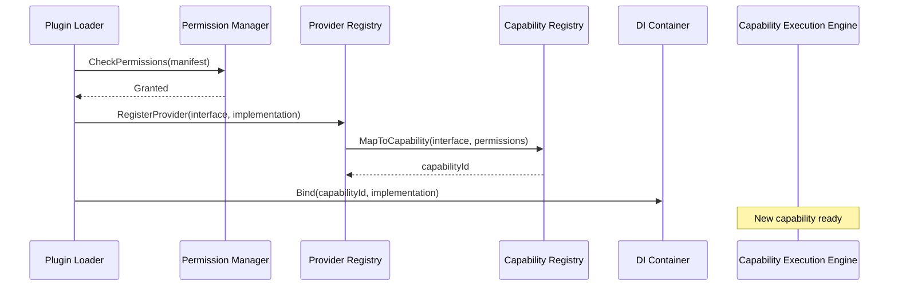

29.3 Capability Lifecycle Management & Sandboxing

Every capability, once registered, is managed through a well‑defined runtime lifecycle enforced by the Capability Execution Engine (CEE). This ensures isolation, resource control, and predictable behaviour.

Lifecycle States

State Description
REGISTERED Capability manifest validated and registered; not yet instantiated.
INITIALIZING CEE creates an isolated execution context (sandbox) and loads the capability implementation.
HEALTHY Capability ready to accept invocations; heartbeat signals indicate liveness.
ACTIVE Capability currently executing a request.
DEGRADED Capability operational but with reduced functionality (e.g., fallback mode).
FAILED Capability encountered an unrecoverable error; context terminated.
RETIRING Capability draining pending requests after a deprecation notice.
TERMINATED Context destroyed; all resources released.

Transitions: REGISTERED → INITIALIZING → HEALTHY. HEALTHY → ACTIVE on invocation, back to HEALTHY on completion. HEALTHY → DEGRADED when circuit breaker opens; DEGRADED → HEALTHY after recovery. Any state → FAILED on unrecoverable error; FAILED → REGISTERED after re‑initialisation. RETIRING → TERMINATED after drain.

Sandboxing Model

Each capability runs in an isolated environment:

· Process isolation – Capabilities that execute native code (e.g., Code Executor via OpenHands) run in a dedicated sandbox process with se‑comp, namespaces, or equivalent OS‑level restrictions.
· Memory & CPU limits – Configured per capability via the manifest. CEE enforces cgroups/quotas where available.
· File system access – Restricted to capability‑specific temporary directories; shared data access is mediated by the Memory Engine.
· Network access – Default‑deny; granted only if declared in the manifest and approved by the Permission Manager.
· Inter‑capability communication – Forbidden directly; all interaction must go through the Event Bus and kernel interfaces.

Health Monitoring

The CEE periodically checks capability health via a standard HealthCheck() method (required on every capability implementation). A missed heartbeat or error response transitions the capability to DEGRADED and triggers an alert. Persistent failures lead to FAILED and automatic restart (up to a configured maximum).

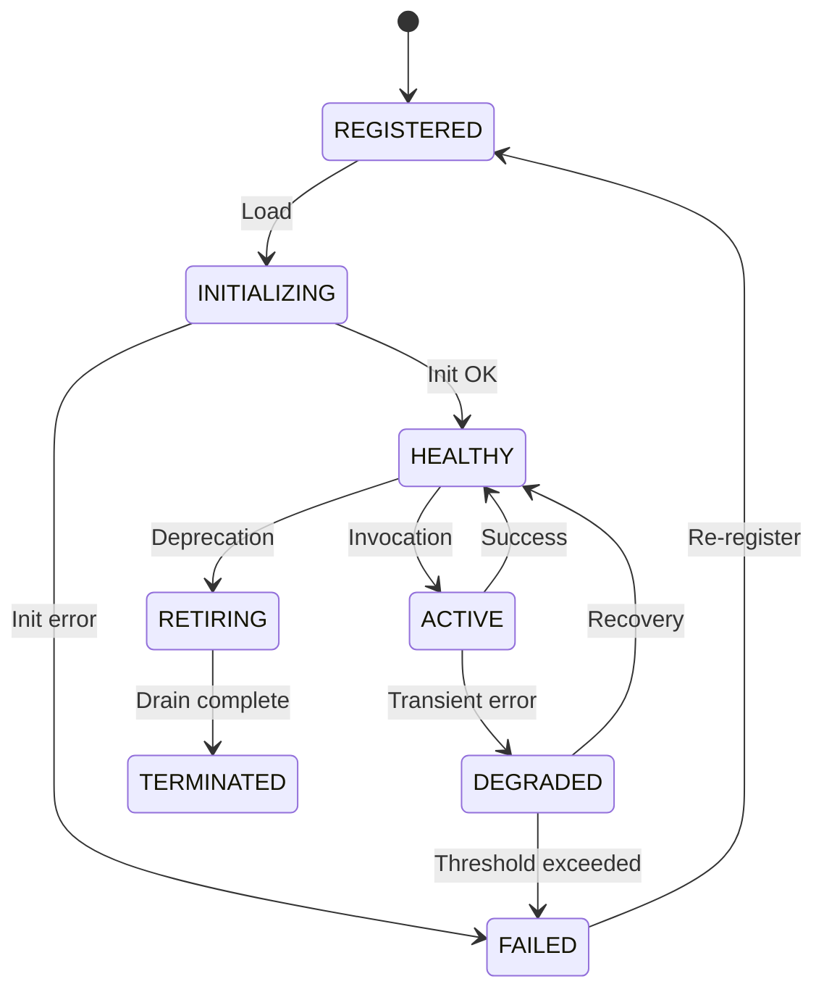

---

30. MODEL ROUTING STRATEGY

The Model Router is the cognitive subsystem responsible for selecting the optimal language, embedding, or vision model for a given request. It does not implement models; it delegates to adapters behind the IModelAdapter interface. This section details the architectural decision points and policies.

30.1 Routing Dimensions

The routing decision evaluates the following orthogonal dimensions:

Dimension Examples Source of Truth
Task type Reasoning, coding, summarisation, conversation, embedding, vision, speech, tool use Cognitive plan metadata
Latency budget Real‑time (<300 ms), interactive (<2 s), batch Service level objective in request context
Hardware capability GPU memory, CPU cores, available accelerators System telemetry
Model availability Local model loaded, remote adapter reachable Adapter health checks
Privacy requirement Strictly local, hybrid, cloud‑allowed User profile privacy tier
Quality requirement Precision, creativity, factual accuracy Task‑specific quality flags
Cost budget Token cost (if cloud), energy consumption (local) Runtime configuration

30.2 Routing Policies

Policies are evaluated in order; the first matching policy is applied.

1. Privacy Gate – If the privacy tier is strict‑local, any cloud‑only adapter is immediately excluded.
2. Capability Availability – Only models that can satisfy the required output type (e.g., structured JSON for tool use, embeddings for retrieval) are considered.
3. Latency Slice – Candidates are filtered by their estimated latency under current hardware load.
4. Quality‑Capacity Trade‑off – Among remaining candidates, a heuristic combines quality benchmarks and available capacity to maximise quality under resource constraints.
5. Fallback Chain – If the primary model fails or times out, the Router proceeds to the next candidate in the ranked list, updating the event log.

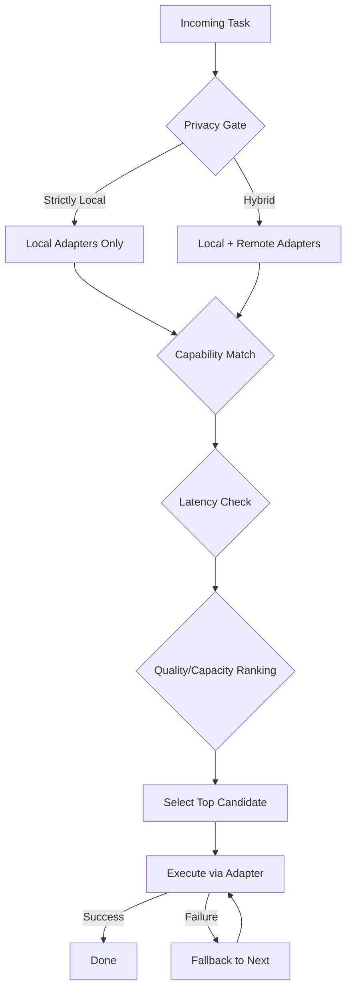

30.3 Adapter‑Based Execution

The Router never calls models directly. It invokes IModelAdapter.RunAsync(prompt, parameters) on the selected adapter. Each adapter implements circuit‑breaker logic, retries, and telemetry emission. Observability data is streamed via the OpenTelemetry‑compatible adapter.

---

31. MEMORY HIERARCHY

Chhaya implements a multi‑tier memory architecture to support real‑time conversation, learning, and retrospective reasoning. Each tier has a distinct purpose, retention policy, and ownership. The Memory Engine provides low‑level storage primitives; the Knowledge Engine builds semantic indices on higher tiers.

31.1 Memory Tiers

Tier Purpose Retention Ownership Access Pattern Eviction Strategy
Working Memory Active plan variables, intermediate reasoning results, tool outputs. Single task lifetime Planner / Workflow Read/write, high frequency Cleared on task completion
Conversation Memory Recent dialogue turns, unresolved user intents, short‑term context. Current conversation session Conversation Engine Append‑only log, sliding window Session end or max turns
Short‑Term Memory Facts and entities used across multiple conversations within a time window (minutes to hours). Time‑to‑live (TTL) of several hours Knowledge Engine Read‑heavy, query by time and relevance TTL expiration, least recently used
Semantic Memory Structured knowledge about the world and the user (concepts, preferences, routines). Persistent User Profile subsystem Read‑mostly, graph queries Explicit user deletion or deprecation
Procedural Memory Learned sequences of actions, successful plan templates, capability usage patterns. Persistent Learning Agent / Knowledge Engine Read/write after successful execution Versioned, superseded by improved plans
Long‑Term Memory Important past conversations, summaries, and personally significant events. Persistent, encrypted Memory Engine (through IVectorStore) Sparse retrieval via RAG Manual or policy‑based archival
Archive Memory Full conversation logs, raw sensor data, old knowledge snapshots. Persistent, compressed, possibly cold storage Infrastructure (configurable backend) Batch access for audit or retraining Archive‑after‑duration policy

31.2 Relationship with Subsystems

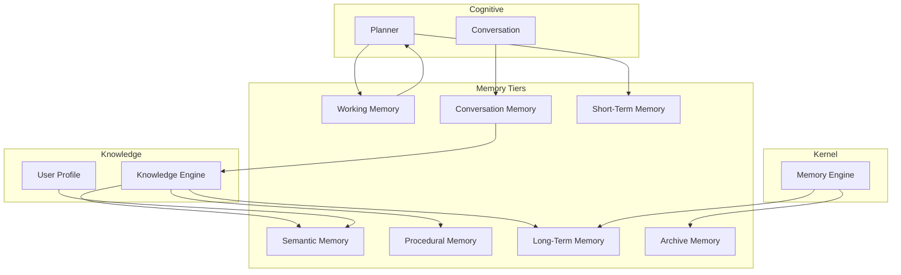

All higher tiers are accessed through the Knowledge Engine, which in turn uses the Memory Engine’s IVectorStore, IKeyValueStore, and IGraphStore adapters. The Memory Engine enforces encryption at rest and access logging.

---

32. CONTEXT ASSEMBLY PIPELINE

The Context Builder constructs a minimal, high‑signal context payload that fits within the model’s token window while preserving all information necessary for accurate reasoning and planning. The pipeline is executed for every inference request after planning.

32.1 Pipeline Stages

1. Source Collection – The builder gathers data from:
   · Current conversation history (Conversation Memory)
   · User profile attributes (Semantic Memory)
   · Working memory variables (active plan state)
   · Long‑term memory retrieval results (RAG)
   · Capability execution outputs (if re‑prompting after an action)
   · Planner requirements (explicit hints about needed data)
2. Filtering – Sources are filtered based on freshness, relevance score, and explicit user consent flags. Data marked as sensitive or expired is removed.
3. Ranking – A heuristic ranking assigns weights to each piece of information using:
   · Recency (time since last access)
   · Relevance to current plan node (cosine similarity of embeddings)
   · User preference for type of memory (e.g., user prefers procedural reminders)
   · System‑defined priority (safety rules, mandatory context)
4. Prioritization – The ranked list is truncated to meet the model’s token budget. Higher‑ranked items are included first; low‑ranked items may be summarised or dropped.
5. Formatting – The selected items are rendered into a structured format compatible with the Prompt Engine’s template placeholders (e.g., YAML‑like sections). No raw model‑specific tokens are injected.
6. Budget Enforcement – The final context size is validated against the Model Router’s known token limit. If oversized, an aggressive summarisation or chunk dropping occurs, and a telemetry warning is emitted.

```mermaid
flowchart LR
    A[Trigger: Context Needed] --> B[Source Collection]
    B --> C[Filtering]
    C --> D[Ranking]
    D --> E[Prioritization (Token Budget)]
    E --> F[Formatting]
    F --> G[Budget Check]
    G -->|OK| H[Deliver to Prompt Engine]
    G -->|Exceeded| E
```

32.2 Context Sources Ownership

Source Owner Subsystem
Conversation History Conversation Engine
User Profile User Profile (Knowledge)
Working Memory Planner
RAG Results Knowledge Engine
Capability Results Workflow Engine
Planner Requirements Planner

The Context Builder depends only on interfaces provided by these subsystems, never on their concrete implementations.

---

33. ERROR RECOVERY ARCHITECTURE

Chhaya is designed to gracefully handle failures across all layers without losing user trust or data. The error recovery architecture defines patterns for detection, retry, fallback, and degradation, ensuring resilient operation.

33.1 Error Categories and Responses

Error Type Detection Response Strategy
Capability Failure (e.g., browser crash) Capability Execution Engine timeout or exception Retry (max 3 attempts), then fallback capability, then notify user
Model Inference Timeout Model Router circuit breaker Retry with faster model; if persistent, fallback to simplified reasoning
Knowledge Retrieval Failure RAG adapter error Use cached results; if unavailable, continue with conversation memory only
Planner Inconsistency Plan validation failure Re‑evaluate plan with additional constraints; if repeated, request user clarification
Internal Kernel Error Unhandled exception in kernel component Publish SYSTEM.ERROR.CRITICAL, attempt state snapshot, and enter ERROR_RECOVERY state

33.2 Recovery Patterns

· Retry with Backoff – Transient errors (network, resource contention) trigger exponential backoff up to a maximum number of attempts.
· Fallback Capability – If a capability cannot be executed, the Planner may substitute an alternative that achieves a similar goal (e.g., browser search falls back to cached knowledge).
· Planner Re‑evaluation – When multiple capability failures occur, the Planner re‑evaluates the entire plan, possibly requesting user input or adjusting the goal.
· Graceful Degradation – The system continues with reduced functionality (e.g., text‑only response if voice synthesis fails). The user is informed unobtrusively.
· Telemetry & Notification – Every error generates a structured telemetry event. Critical failures notify the user via the Interface.

```mermaid
flowchart TD
    E[Error Detected] -->|Transient?| Retry{Retry Count < Max?}
    Retry -->|Yes| Wait[Backoff] --> Exec[Re‑attempt]
    Exec -->|Success| Done
    Exec -->|Failure| Retry
    Retry -->|No| Fallback[Attempt Fallback Capability]
    Fallback -->|Available| FExec[Execute Fallback]
    FExec -->|Success| DoneDegraded[Success (degraded)]
    FExec -->|Failure| Replan[Planner Re‑evaluation]
    Replan -->|Plan Adjusted| NewPlan[Execute New Plan]
    Replan -->|Unrecoverable| UserNotify[Notify User]
    Fallback -->|Not Available| Replan
    E -->|Critical| KernelHandler[Enter ERROR_RECOVERY state, snapshot, notify]
```

All recovery actions are logged with correlation IDs for tracing.

33.5 Observability Pipeline & Health Check Architecture

Chhaya’s observability architecture provides a unified pipeline for traces, metrics, and logs, with built‑in health checking for all subsystems.

Pipeline Architecture

1. Emission – Every subsystem emits telemetry using the kernel’s ITelemetrySink interface. Events, metrics, and spans are produced without knowledge of the backend.
2. Collection – An in‑process collector aggregates signals and performs local filtering, buffering, and sampling. This collector is itself an adapter implementing ITelemetrySink.
3. Processing – Traces are enriched with context (security token hash, plan ID, capability ID). Logs are structured and masked to strip sensitive data.
4. Export – The collector pushes data to configured backends (OpenTelemetry collector, Langfuse) via adapters. Local‑first deployments can export to an on‑device dashboard or file sink; cloud‑augmented mode streams to a remote observability platform.
5. Alerting – Threshold‑based alerts (error rate, latency spike, capability failures) are evaluated locally. Critical alerts are published as system events and may trigger notifications through the Interface layer.

Health Check Architecture

Every major subsystem exposes a standard health endpoint:

· Kernel – IKernelHealth reports DI container status, event bus lag, state store connectivity.
· Infrastructure – Adapters report connectivity to external resources (Qdrant, etc.) and circuit‑breaker states.
· Cognitive – Model Router reports model adapter availability and last known latency.
· Capabilities – As described in 29.3, each capability provides a HealthCheck() method.

A central Health Aggregator polls all health indicators and computes an overall system status: HEALTHY, DEGRADED, or UNHEALTHY. This status is exposed via the API Server at GET /health and via a dedicated desktop/system tray indicator. Health transitions are published as SYSTEM.HEALTH.CHANGED events.

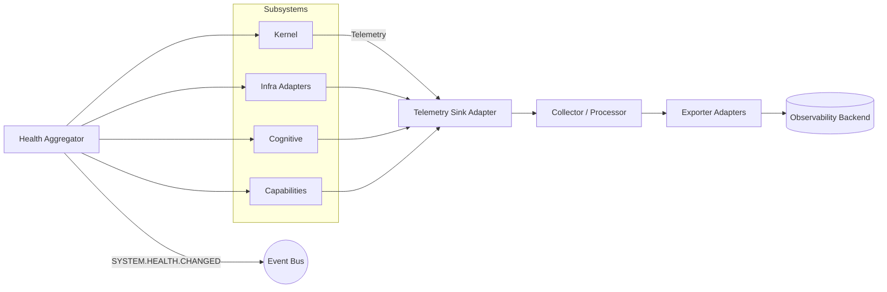

---

34. LEARNING FEEDBACK LOOP

Chhaya employs a continuous, privacy‑preserving learning loop that improves system behaviour without sending raw user data off‑device. The loop is triggered after every task completion and only operates on anonymised, aggregated signals.

34.1 Feedback Loop Steps

1. Execution Result – The Workflow Engine publishes TASK.COMPLETED with the full outcome, capabilities used, and timing.
2. Reflection – The Reflection Agent compares actual outcomes with expected outcomes. It identifies successes, failures, and surprises, generating a structured IMPROVEMENT_SIGNAL.
3. Evaluation – The Learning Agent evaluates the signal against historical patterns. For example, a consistently slow capability triggers a suggestion to prefer an alternative.
4. Memory Update – Based on evaluation, the Learning Agent updates:
   · User Profile – adjusts confidence in preferences, learns new routines.
   · Procedural Memory – stores successful plan templates, deprecates outdated ones.
   · Long‑Term Memory – consolidates important facts or summaries.
5. Knowledge Update – The Knowledge Engine re‑indexes updated long‑term and procedural memories, refreshing vector embeddings.
6. Prompt Optimization – Successful prompt patterns (e.g., a certain template that led to high‑quality plans) are recorded and reused, while ineffective patterns are deprecated.
7. Future Planning Improvements – The Planner gains access to updated procedural memory, making subsequent plans more efficient.

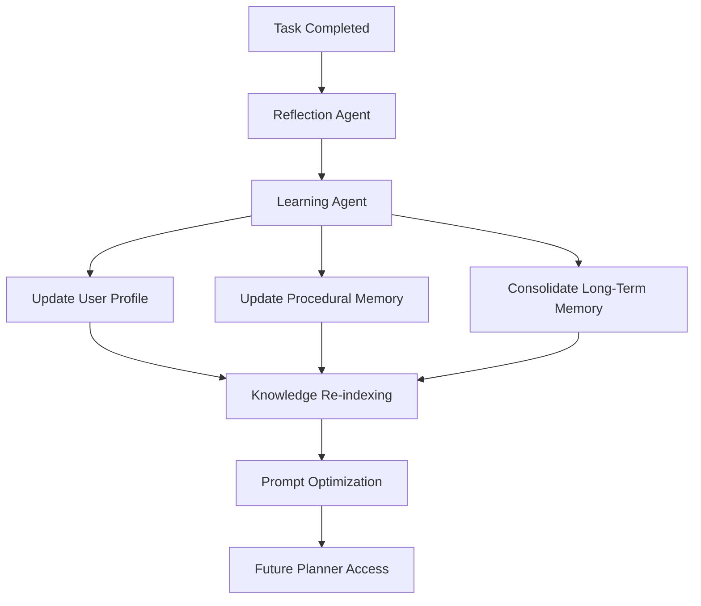

34.2 Privacy Preservation

· All learning is performed on‑device. No raw conversation data or personal facts are transmitted.
· Improvement signals are aggregated and anonymised before any optional, user‑authorised telemetry is shared.
· The user retains full control: learning can be paused, reviewed, or reset via the User Profile interface.
· The Learning Agent does not have direct access to raw user input; it only processes derived, sanitised meta‑data.

---

35. INTERNAL PACKAGE DEPENDENCY RULES

This chapter codifies the architectural governance rules that enforce layer isolation, dependency direction, and framework integrity. These rules are enforced by automated architecture fitness functions and code review policy.

35.1 Dependency Rules

Rule Scope Rationale
Kernel imports nothing The kernel package must not import any module outside the language standard library. Guarantees kernel immutability and zero external coupling.
Infrastructure imports Kernel interfaces only infrastructure may import kernel.interfaces, but never kernel implementation modules. Prevents Infrastructure from binding to kernel internals; enables kernel replacement or testing.
Cognitive cannot import Infrastructure implementations cognitive packages may only depend on domain interfaces, never on infrastructure.adapters.*. Keeps cognitive logic pure and testable without OSS frameworks.
Knowledge cannot import adapters knowledge must use IVectorStore, IEmbedder, etc., not concrete Qdrant or LlamaIndex classes. Allows swapping vector stores and embedding models without altering knowledge logic.
Capabilities communicate through interfaces Capability implementations must never directly call other capabilities’ concrete classes. Ensures each capability is independently replaceable and sandboxed.
Plugins never communicate directly Plugin assemblies must not reference other plugins; all inter‑plugin collaboration goes through the Event Bus. Prevents hidden dependency chains and simplifies lifecycle management.
EventBus mandatory for state‑changing operations Any operation that mutates system state must be initiated by publishing an event, not a direct method call. Ensures consistency, auditability, and replay capability.
No circular imports The package dependency graph must remain acyclic. Preserves build determinism and clean architecture layering.
No framework leakage No domain or kernel module may import a third‑party library type directly; all such usage is confined to infrastructure.adapters and wrapped in kernel interfaces. Prevents vendor lock‑in and simplifies upgrades.

35.2 Enforcement

Architecture fitness functions (see 36.7) verify these rules in the CI pipeline. Violations cause build failure. Manual waivers require formal architecture board approval.

---

36. ADDITIONAL ARCHITECTURAL POLICIES

36.1 Boot Sequence

The system startup follows a deterministic boot sequence to guarantee service readiness.

```mermaid
sequenceDiagram
    participant OS as Operating System
    participant Kernel as Kernel Bootstrap
    participant DI as DI Container
    participant EB as Event Bus
    participant SM as State Manager
    participant PL as Plugin Loader
    participant Infra as Infrastructure
    participant AR as Agent Runtime

    OS->>Kernel: Launch process
    Kernel->>DI: Initialize container
    DI->>EB: Create Event Bus
    DI->>SM: Create State Manager
    SM->>EB: Publish SYSTEM.STATE.CHANGED (BOOT->INITIALIZATION)
    Kernel->>Infra: Load configuration
    Infra->>EB: CONFIG.LOADED
    Kernel->>PL: Load plugins
    PL->>EB: PLUGINS.REGISTERED
    SM->>EB: SYSTEM.STATE.CHANGED (->READY)
    Kernel->>AR: Start Agent Runtime
    AR->>EB: SYSTEM.READY
    Note over AR: System idle, awaiting input
```

36.2 Event Naming Standard

All events follow the convention DOMAIN.ACTION.STATUS (uppercase, dot‑separated). This standard enables predictable subscription and filtering.

Examples:

· INTENT.RECEIVED.SUCCESS
· PLAN.CREATED.PROPOSED
· CAPABILITY.EXECUTED.COMPLETE
· CAPABILITY.EXECUTED.FAILED
· MODEL.ROUTED.SELECTED
· MEMORY.UPDATED.LONGTERM
· SYSTEM.STATE.CHANGED
· USER.PROFILE.UPDATED.PREFERENCE
· LEARNING.FEEDBACK.GENERATED

Event schemas are versioned (e.g., INTENT.RECEIVED.SUCCESS.v1). Backward‑incompatible changes produce a new version; the Event Bus supports translation adapters for a deprecation window.

36.3 Configuration Hierarchy

Configuration is merged from multiple sources with the following precedence (lowest to highest):

1. Defaults – hardcoded safe values inside each subsystem.
2. System – OS‑level configuration files (/etc/chhaya/config.yaml).
3. User – user‑specific overrides (~/.chhaya/config.yaml).
4. Plugin – configuration schemas supplied by plugins, user‑edited values.
5. Runtime Overrides – environment variables, command‑line flags, or admin API calls.

Merge rules: arrays are replaced (not merged), scalars are overwritten by higher‑precedence values. Configuration changes are validated against JSON schemas and, if invalid, the system retains the last known good configuration and logs an error.

36.4 Plugin Compatibility Policy

Plugins declare their API compatibility via semantic versioning (MAJOR.MINOR.PATCH).

· MAJOR increment indicates breaking changes to the plugin interface or behaviour.
· MINOR increment indicates new backward‑compatible functionality.
· PATCH increment indicates backward‑compatible bug fixes.

The system will load a plugin only if its MAJOR version matches the expected capability interface version. A deprecation period of one minor version cycle is observed before removing support for an older interface. The Capability Registry maintains a compatibility matrix and raises telemetry warnings when deprecated plugins are loaded.

36.5 Architecture Evolution Policy

Future versions of Chhaya must evolve the architecture without violating the frozen kernel principles. Additions follow these rules:

· New kernel services may be added only if they are self‑contained and use existing kernel interfaces; no changes to existing kernel APIs are permitted.
· Existing interfaces may be extended with new methods only if a default implementation is provided (to avoid breaking existing adapters).
· New layers or subsystems must adhere to the same dependency direction and event‑driven communication.
· Breaking changes to the event schema require a new version and a published translation adapter; the old schema is supported for at least one major release cycle.
· All architectural changes are reviewed against the fitness function suite, and any needed updates to fitness functions are approved separately.

36.6 Upgrade & Migration Strategy

Chhaya supports in‑place upgrades without user data loss, following a strictly controlled migration protocol.

Upgrade Phases

1. Pre‑flight Check – The new version’s installer validates hardware compatibility, available disk space, and state store version. Incompatibilities abort the upgrade with a user‑friendly message.
2. State Backup – The State Manager creates an automatic snapshot of the event store and all persistent memory tiers before any migration begins. This snapshot is stored in a rollback directory.
3. Schema Migration – The Configuration Provider applies versioned migration scripts to user configuration, event store schemas, and knowledge indices. Each migration is idempotent and backwards‑compatible within a major version.
4. Plugin Re‑validation – All installed plugins are re‑validated against the new compatibility matrix. Plugins that declare an incompatible major version are disabled (with user notification) but not deleted.
5. Post‑upgrade Verification – The fitness function suite runs automatically. Any architecture violation or broken integration test triggers a rollback to the previous version using the backup snapshot.

Rollback Strategy

If post‑upgrade verification fails or the user explicitly requests rollback within a defined window (e.g., 24 hours), the system restores the previous binary and reverts the state store to the pre‑upgrade snapshot. The rollback is atomic and does not affect the snapshot’s integrity.

Data Forward Compatibility

All persistent data structures (event schemas, vector index formats, knowledge graph serialization) are versioned. The current version can read data written by any older version within the same major release. Forward compatibility (older version reading newer data) is not guaranteed, which is why the rollback snapshot is essential.

User‑Visible Impact

Upgrades are performed in the background while the system is idle. The Agent Runtime suspends new tasks, drains active capabilities, and resumes after migration. A minimal maintenance window (< 30 seconds for typical upgrades) is communicated through the Interface.

36.7 Architecture Fitness Functions

Automated tests in the CI pipeline act as architecture fitness functions. They are non‑negotiable gatekeepers.

Function Description Violation Consequence
Layer dependency check Verifies that imports between packages respect the allowed dependency graph. Build fails.
Import rules Ensures kernel modules use only stdlib; infrastructure imports only kernel interfaces; cognitive and knowledge layers import no infrastructure adapters. Build fails.
Event naming validation All event types published in code match the DOMAIN.ACTION.STATUS pattern. Build fails.
Adapter isolation Confirms that no domain package references any concrete class from an OSS library; all such references are in infrastructure adapters. Build fails.
Interface compliance Every adapter implements the full abstract interface declared in kernel or domain. Build fails.
Plugin validation Simulates plugin loading and verifies that manifest, permission, and registration steps succeed. Integration test failure.
Circular dependency detection Static analysis of import graph ensures acyclic relationships. Build fails.
Event schema versioning Every event class has a schema_version attribute and a corresponding JSON schema file. Build warning; after grace period, failure.
Exact‑once semantics coverage Every event handler implements idempotency logic (detected via annotations or pattern). Build fails.

These fitness functions ensure that the architecture remains clean as the codebase evolves, preventing architectural drift.

---

APPENDIX A – ARCHITECTURE REVIEW NOTES

The following independent review was conducted against the architectural constraints and principles. Recommendations aim to strengthen consistency and long‑term maintainability without violating the immutable kernel or local‑first mandate.

1. Exact‑once event semantics require transactional outbox
      The Kernel Event Bus’s exact‑once guarantee cannot be implemented purely in‑memory. Recommendation: The State Manager should incorporate an event store that doubles as the outbox. The Event Bus dispatches from that store, and consumers use idempotency keys. This aligns with event‑sourcing and enables replay, audit, and temporal queries, all without kernel API changes.
2. Agent Runtime and Task Scheduler boundary
      The two components share scheduling and execution concerns. Recommendation: Formally define ITaskScheduler as the single point of execution for all asynchronous work. Agent Runtime becomes a coordinator that translates agent plans into scheduled tasks, removing ambiguity and enabling a clean swap with Temporal for distributed deployments.
3. Capability Execution Engine naming and scope
      The kernel already contains a Capability Execution Engine, while the higher Capability Layer holds actual implementations. This risks confusion. Recommendation: Rename the kernel component to Capability Invoker (or keep the name but explicitly document it as a dispatcher). It should only resolve and invoke a registered ICapability adapter; all implementation logic lives in the capability layer. This clarifies that the kernel owns mechanism, not behaviour.
4. Memory Engine vs Knowledge Engine separation
      The kernel Memory Engine provides raw storage abstractions (IKeyValueStore, IVectorStore). The Knowledge Engine builds semantic indexes on top. This is correct but must be enforced. Recommendation: Ensure no Knowledge Engine code directly imports Qdrant or any vector library; it must rely on the IVectorStore adapter injected from Infrastructure.
5. Plugin configuration extensibility
      New plugins may introduce configuration sections unknown to the core configuration schema. Recommendation: Extend the IConfigurationProvider to support plugin‑specific configuration namespaces that are validated against JSON schemas supplied by the plugin manifest. This prevents central schema changes for every plugin.
6. Security Context propagation
      The architecture mentions a Security Context but does not specify its propagation mechanism across async event handlers. Recommendation: Each event envelope must carry a serialisable security token. The Event Bus copies the token from the publishing context to the subscriber context, enabling permission checks at the point of capability execution.
7. Temporal integration optionality
      Temporal is a powerful but heavy dependency. Recommendation: The default ITaskScheduler implementation should be a local, in‑process durable scheduler (e.g., using the State Manager’s event store). The Temporal adapter becomes a drop‑in replacement for deployments that need cluster‑wide scheduling. This keeps the local‑first experience dependency‑light.
8. Architecture fitness functions
      To protect the package dependency rules and kernel immutability, Recommendation: Implement automated architecture tests (e.g., Python pytest-arch or equivalent) that fail the build if a kernel module imports any third‑party library, or if a domain layer directly imports an infrastructure adapter. These tests become part of the CI pipeline and serve as automated gatekeepers of the architecture.
9. Adapters should implement kernel interfaces directly
      To avoid leaky abstractions, every adapter must implement its interface exactly as defined in Kernel. Recommendation: Use compiled‑time checks (abstract base classes with @abstractmethod) to ensure no adapter‑specific methods leak into calling code. Observability adapters, for instance, must not expose OpenTelemetry Span objects to the domain.
10. Versioned event schemas with compatibility windows
        The specification mentions event schema versioning; Recommendation: Adopt a confluent schema registry pattern (lightweight, local) where each event type declares a version and a compatibility mode (forward, backward, full). This enables safe evolution without breaking replay of historical events.

All recommendations honour the immutable kernel, event‑driven design, and local‑first principle. They are intended to harden an already well‑structured architecture before implementation scaling.

---

End of Document