# Chhaya OS Integration Blueprint

## 1. Executive Summary

This document serves as the definitive engineering contract and implementation blueprint for scaling the Chhaya AI OS. It defines how future capabilities, orchestration engines, and domain-specific runtimes will securely and seamlessly integrate with the established Chhaya Kernel (Subsystems 1-12).

The core principle of Chhaya is absolute ownership of business logic, event orchestration, state management, and memory isolation. Third-party Open Source Software (OSS) frameworks (e.g., LangGraph, Temporal, LlamaIndex, LiteLLM) are strictly relegated to **infrastructure providers**. They must never permeate the core abstractions of the OS. All communication between the kernel and these providers is mediated via standard Adapter patterns, Dependency Injection, and the EventBus.

---

## 2. Build vs. Integrate Matrix

Before detailing each subsystem, we classify our architectural approach into four categories:
*   **BUILD:** Chhaya owns the core engine. No external framework is used.
*   **INTEGRATE:** Chhaya builds an adapter around a specific OSS tool to provide the underlying implementation.
*   **REFERENCE ONLY:** Chhaya extracts patterns from the OSS tool but writes a native implementation from scratch.
*   **REJECT:** The OSS tool is fundamentally misaligned with local-first, OS-level constraints.

| Subsystem | Classification | Target OSS Framework | Rationale |
| :--- | :--- | :--- | :--- |
| **Planner / Goal Engine** | **INTEGRATE** | LangGraph | Complex DAG evaluations and cyclic graph planning are tedious to write natively. We will wrap LangGraph to act as a DAG solver, but Chhaya will control the Node implementations and State tracking. |
| **Workflow Engine** | **INTEGRATE** | Temporal | Durability, backoff, and distributed workflow execution are exceptionally hard to build. Temporal serves as the durable orchestrator, but the tasks it runs are strictly Chhaya `TaskScheduler` primitives. |
| **Model Router** | **INTEGRATE** | LiteLLM | Standardizes 100+ LLM API schemas. Chhaya wraps it inside an `ILLMProvider` interface to retain abstraction control. |
| **Knowledge Engine** | **BUILD** | N/A | Chhaya manages its own ontology and Memory Engine (Subsystem 12). |
| **RAG Pipeline** | **INTEGRATE** | LlamaIndex + Qdrant | LlamaIndex provides excellent chunking/embedding utilities; Qdrant provides vector storage. Chhaya wraps them into `MemoryRetriever` and `MemoryIndexer` protocols. |
| **Reasoning / Reflection / Learning** | **BUILD** | N/A | Core to the autonomous nature of Chhaya. Relying on external frameworks for reasoning dilutes the OS's autonomy. |
| **Conversation Manager** | **BUILD** | N/A | Must tie deeply into Subsystem 12 (Memory) and the EventBus. |
| **Browser Automation** | **INTEGRATE** | Browser Use / Playwright | OSS tools handle the DOM and CDP connections natively. Chhaya wraps them as secure Capabilities. |
| **Voice / Vision** | **INTEGRATE** | Faster Whisper / Piper | High-performance inference models. Handled via ProviderRegistry. |
| **Code Execution** | **REFERENCE ONLY** | OpenHands | Reference their sandboxing techniques, but build a native containerized executor to maintain extreme security/isolation. |
| **Security / Auth** | **INTEGRATE** | Casbin | Robust ABAC/RBAC enforcement. |
| **Telemetry / Observability** | **INTEGRATE** | OpenTelemetry / Langfuse | Standardized traces and metrics exporting. |
| **Client Interfaces (API, Desktop, Android)** | **BUILD** | FastAPI, Tauri, Flutter | Custom frontends and API layers designed strictly around the Kernel's public capabilities. |

---

## 3. Subsystem Integration Profiles

### 3.1 Planner / Goal Engine
1.  **Purpose:** Translate high-level user objectives into step-by-step actionable plans (DAGs) for Agents.
2.  **Responsibilities:** Goal decomposition, cyclic planning, dynamic replanning based on failures.
3.  **Dependencies on Kernel:** `AgentRuntime`, `EventBus`, `CapabilityRegistry`.
4.  **Kernel Services to Reuse:** `TaskScheduler` (for async planning evaluation).
5.  **External Repository:** LangGraph.
6.  **Parts Used:** DAG StateGraph execution, cyclic routing.
7.  **Parts NOT Used:** LangChain runnables, LangChain LLM integrations, LCEL.
8.  **Adapter Architecture:** A `GoalPlanner(Protocol)` implemented by `LangGraphPlanner`. The planner receives an `AgentContext` and emits a list of `AgentStep` objects.
9.  **Events Published:** `planner.plan.started`, `planner.plan.completed`, `planner.replanning.triggered`.
10. **Events Consumed:** `domain.agent.failed` (triggers replanning).
11. **Required Interfaces:** `IPlanner`, `IPlanState`.
12. **Required Services:** `AgentManager`.
13. **Required Data Models:** `Goal`, `Plan`, `PlanStep`.
14. **Required Configuration:** Max graph depth, timeout.
15. **Testing Strategy:** Mock LLMs to force cyclic paths; verify EventBus emissions.
16. **Risks:** LangGraph state leakage. *Mitigation:* Isolate LangGraph state within the execution wrapper.
17. **Future Extensibility:** Can swap LangGraph for a native AST-based planner.

### 3.2 Workflow Engine
1.  **Purpose:** Guarantee durability and resumption of long-running, multi-agent processes.
2.  **Responsibilities:** Durable execution, saga patterns, cross-node orchestration.
3.  **Dependencies on Kernel:** `EventBus`, `StateManager`.
4.  **Kernel Services to Reuse:** `LifecycleManager`.
5.  **External Repository:** Temporal.
6.  **Parts Used:** Workflow execution, Activity polling.
7.  **Parts NOT Used:** Temporal's internal state management (Chhaya StateManager remains the source of truth).
8.  **Adapter Architecture:** Chhaya implements a `WorkflowManager` that translates Chhaya Events into Temporal Signals. Temporal Activities map directly to Chhaya Capabilities.
9.  **Events Published:** `workflow.execution.started`, `workflow.activity.completed`, `workflow.execution.completed`.
10. **Events Consumed:** `capability.execution.completed`.
11. **Required Interfaces:** `IWorkflowEngine`.
12. **Required Services:** Temporal Server (via Docker).
13. **Required Data Models:** `WorkflowDefinition`, `SagaState`.
14. **Required Configuration:** Temporal connection strings, task queues.
15. **Testing Strategy:** Simulate node crash and verify state resumption.
16. **Risks:** High operational overhead. *Mitigation:* Ensure local-first fallback using native TaskScheduler if Temporal is unavailable.
17. **Future Extensibility:** Distributed cluster scaling.

### 3.3 Model Router
1.  **Purpose:** Route inference requests to the most appropriate, cost-effective, or capable local/cloud model.
2.  **Responsibilities:** Prompt formatting, token counting, failover routing, rate limiting.
3.  **Dependencies on Kernel:** `ProviderRegistry`.
4.  **Kernel Services to Reuse:** `DIContainer`, `ConfigManager`.
5.  **External Repository:** LiteLLM.
6.  **Parts Used:** Router logic, normalized schemas.
7.  **Parts NOT Used:** LiteLLM's internal caching (use Chhaya Memory Engine).
8.  **Adapter Architecture:** A `ModelRouter` class implementing `ILLMProvider`.
9.  **Events Published:** `llm.inference.started`, `llm.inference.completed`, `llm.inference.fallback`.
10. **Events Consumed:** N/A.
11. **Required Interfaces:** `ILLMProvider`.
12. **Required Services:** ConfigManager for routing rules.
13. **Required Data Models:** `InferenceRequest`, `InferenceResponse`.
14. **Required Configuration:** API Keys, Local Ollama endpoints, failover tiers.
15. **Testing Strategy:** Mock endpoint failures to verify LiteLLM fallback chains.
16. **Risks:** Vendor lock-in to LiteLLM schemas. *Mitigation:* Strict internal DTOs (`InferenceRequest`).
17. **Future Extensibility:** Dynamic routing based on `LearningEngine` latency metrics.

### 3.4 Knowledge Engine & RAG Pipeline
1.  **Purpose:** Ingest, chunk, embed, and retrieve dense document data.
2.  **Responsibilities:** Semantic ingestion, hybrid search, vector DB synchronization.
3.  **Dependencies on Kernel:** `MemoryEngine` (Subsystem 12), `CapabilityEngine`.
4.  **Kernel Services to Reuse:** `TaskScheduler` (for background indexing).
5.  **External Repository:** LlamaIndex & Qdrant.
6.  **Parts Used:** Node parsers, embedding models, Qdrant indexing.
7.  **Parts NOT Used:** LlamaIndex's Agent/LLM orchestration.
8.  **Adapter Architecture:** `QdrantStore` implementing `MemoryStore`; `LlamaRetriever` implementing `MemoryRetriever`.
9.  **Events Published:** `knowledge.ingestion.started`, `knowledge.indexing.completed`.
10. **Events Consumed:** `memory.record.created`.
11. **Required Interfaces:** `MemoryRetriever`, `MemoryIndexer`.
12. **Required Services:** Qdrant instance.
13. **Required Data Models:** `DocumentChunk`, `VectorEmbeddings`.
14. **Required Configuration:** Chunk size, overlap, embedding model ID.
15. **Testing Strategy:** Exact match and semantic proximity assertions.
16. **Risks:** Memory bloat during chunking. *Mitigation:* Stream processing.
17. **Future Extensibility:** GraphRAG integration.

### 3.5 Conversation & User Profile Engine
1.  **Purpose:** Maintain cohesive interaction states with humans.
2.  **Responsibilities:** Turn-taking, multi-modal alignment, persona management.
3.  **Dependencies on Kernel:** `StateManager`, `MemoryEngine`.
4.  **Kernel Services to Reuse:** `EventBus`.
5.  **External Repository:** N/A (Build).
6.  **Parts Used:** N/A.
7.  **Parts NOT Used:** N/A.
8.  **Adapter Architecture:** A `SessionManager` mapping User IDs to Conversation Threads.
9.  **Events Published:** `session.initialization.completed`, `session.message.received`.
10. **Events Consumed:** `domain.agent.completed`.
11. **Required Interfaces:** `ISessionManager`.
12. **Required Services:** `AgentManager`.
13. **Required Data Models:** `UserSession`, `ChatTurn`.
14. **Required Configuration:** Max session idle time.
15. **Testing Strategy:** State transitions across multiple concurrent users.
16. **Risks:** Memory leaks from stale sessions. *Mitigation:* Implement TTL on sessions.
17. **Future Extensibility:** Omni-channel chat synchronization.

### 3.6 Reasoning, Reflection & Learning Engines
1.  **Purpose:** Autonomous self-improvement and logic verification.
2.  **Responsibilities:** Chain-of-Thought evaluation, post-task reflection, capability usage optimization.
3.  **Dependencies on Kernel:** `TaskScheduler`, `AgentRuntime`.
4.  **Kernel Services to Reuse:** `CapabilityEngine` metrics.
5.  **External Repository:** N/A (Build).
6.  **Parts Used:** N/A.
7.  **Parts NOT Used:** N/A.
8.  **Adapter Architecture:** Background tasks that consume execution metrics and update system prompts/weights in the `StateManager`.
9.  **Events Published:** `agent.reflection.generated`, `system.learning.applied`.
10. **Events Consumed:** `capability.execution.finished`, `domain.agent.completed`.
11. **Required Interfaces:** `IReflectionEngine`.
12. **Required Services:** `ModelRouter`.
13. **Required Data Models:** `ReflectionContext`, `LearningMetrics`.
14. **Required Configuration:** Learning frequency threshold.
15. **Testing Strategy:** Metric mutation assertions.
16. **Risks:** Feedback loop collapse. *Mitigation:* Bounded adjustments.
17. **Future Extensibility:** Reinforcement learning from human feedback (RLHF).

### 3.7 Browser Automation & Controller
1.  **Purpose:** Enable agents to interact with the web visually and programmatically.
2.  **Responsibilities:** DOM parsing, clicking, scraping, visual tree mapping.
3.  **Dependencies on Kernel:** `CapabilityEngine`.
4.  **Kernel Services to Reuse:** `PluginManager`.
5.  **External Repository:** Browser Use / Playwright.
6.  **Parts Used:** Headless browser control, accessibility tree extraction.
7.  **Parts NOT Used:** Browser Use's native LLM loops.
8.  **Adapter Architecture:** `BrowserCapability` classes implementing `CapabilityExecutor`.
9.  **Events Published:** `browser.navigation.started`, `browser.action.completed`.
10. **Events Consumed:** N/A.
11. **Required Interfaces:** `IBrowserSession`.
12. **Required Services:** Playwright process.
13. **Required Data Models:** `DOMNode`, `ViewportState`.
14. **Required Configuration:** Sandbox mode, proxy settings.
15. **Testing Strategy:** Mock HTTP servers.
16. **Risks:** Captcha blocking. *Mitigation:* Headful execution mode when required.
17. **Future Extensibility:** Visual LLM verification of pages.

### 3.8 Voice & Vision Runtimes
1.  **Purpose:** Audio I/O and visual analysis.
2.  **Responsibilities:** STT, TTS, Image OCR.
3.  **Dependencies on Kernel:** `ProviderRegistry`.
4.  **Kernel Services to Reuse:** `EventBus`.
5.  **External Repository:** Faster Whisper, Piper.
6.  **Parts Used:** Inference endpoints.
7.  **Parts NOT Used:** N/A.
8.  **Adapter Architecture:** `AudioProvider` and `VisionProvider` interfaces.
9.  **Events Published:** `audio.transcription.completed`, `vision.analysis.completed`.
10. **Events Consumed:** `audio.input.received`.
11. **Required Interfaces:** `IAudioProvider`, `IVisionProvider`.
12. **Required Services:** Local GPU resources.
13. **Required Data Models:** `AudioChunk`, `ImageFrame`.
14. **Required Configuration:** VRAM limits, sample rates.
15. **Testing Strategy:** Byte-stream mock processing.
16. **Risks:** Memory OOM. *Mitigation:* Strict 4GB VRAM enforcement.
17. **Future Extensibility:** Real-time lip sync streaming.

### 3.9 Code Execution
1.  **Purpose:** Safe sandbox for agents to run generated code.
2.  **Responsibilities:** Isolation, output capturing.
3.  **Dependencies on Kernel:** `CapabilityEngine`.
4.  **Kernel Services to Reuse:** `PluginManager`.
5.  **External Repository:** OpenHands (Reference).
6.  **Parts Used:** Sandboxing concepts.
7.  **Parts NOT Used:** Agent orchestration code.
8.  **Adapter Architecture:** A secure `DockerCapabilityExecutor`.
9.  **Events Published:** `sandbox.execution.started`, `sandbox.execution.finished`.
10. **Events Consumed:** N/A.
11. **Required Interfaces:** `ISandboxEnvironment`.
12. **Required Services:** Docker daemon.
13. **Required Data Models:** `CodeSnippet`, `ExecutionResult`.
14. **Required Configuration:** CPU/RAM limits per container.
15. **Testing Strategy:** Running malicious code to ensure isolation.
16. **Risks:** Sandbox escape. *Mitigation:* Minimal rootless containers.
17. **Future Extensibility:** Persistent dev-environments for multi-turn tasks.

### 3.10 Security & Telemetry
1.  **Purpose:** RBAC enforcement and observability.
2.  **Responsibilities:** Access control, log tracing.
3.  **Dependencies on Kernel:** `EventBus` middleware.
4.  **Kernel Services to Reuse:** `DIContainer`.
5.  **External Repository:** Casbin, OpenTelemetry, Langfuse.
6.  **Parts Used:** Enforcers, tracers.
7.  **Parts NOT Used:** N/A.
8.  **Adapter Architecture:** `CasbinAuthorizer` implementing `CapabilityAuthorizer`. `OTelMiddleware` observing EventBus.
9.  **Events Published:** `telemetry.trace.exported`.
10. **Events Consumed:** All `*.*.*` events via wildcard.
11. **Required Interfaces:** `IAuthorizer`, `ITracer`.
12. **Required Services:** Langfuse endpoint.
13. **Required Data Models:** `PolicyRule`, `TraceSpan`.
14. **Required Configuration:** Casbin model.conf, OTLP endpoint.
15. **Testing Strategy:** Ensure rejected access does not execute underlying logic.
16. **Risks:** High overhead on every event. *Mitigation:* Async batch exporting.
17. **Future Extensibility:** Real-time intrusion detection.

### 3.11 Client Interfaces (API, Desktop, Android)
1.  **Purpose:** User interaction.
2.  **Responsibilities:** Render data, accept input.
3.  **Dependencies on Kernel:** N/A (Connects externally).
4.  **Kernel Services to Reuse:** N/A.
5.  **External Repository:** FastAPI, Tauri, Flutter.
6.  **Parts Used:** Web frameworks, native UI.
7.  **Parts NOT Used:** State management (delegated to Chhaya Kernel).
8.  **Adapter Architecture:** Strictly consume the Chhaya Kernel API (`SessionManager`, `EventBus` streams).
9.  **Events Published:** N/A.
10. **Events Consumed:** N/A.
11. **Required Interfaces:** WebSockets, REST.
12. **Required Services:** FastAPI uvicorn server.
13. **Required Data Models:** `ClientRequest`, `ClientResponse`.
14. **Required Configuration:** Ports, CORS.
15. **Testing Strategy:** Integration tests simulating HTTP calls.
16. **Risks:** Latency. *Mitigation:* WebSocket streams.
17. **Future Extensibility:** Full distributed cluster management dashboard.

---

## 4. Kernel Dependency Graph

```mermaid
graph TD
    %% Core Kernel
    Kernel[Chhaya Kernel]
    DI[DI Container]
    EB[Event Bus]
    SM[State Manager]
    TS[Task Scheduler]
    PR[Provider Registry]
    CR[Capability Registry]
    ME[Memory Engine]
    AR[Agent Runtime]
    CE[Capability Engine]

    Kernel --> DI & EB & SM & TS & PR & CR & ME & AR & CE

    %% Future Subsystems
    Planner[Planner/Goal Engine] --> AR
    Planner --> EB
    Planner -->|Wraps| LangGraph

    Workflow[Workflow Engine] --> TS
    Workflow --> SM
    Workflow -->|Wraps| Temporal

    Router[Model Router] --> PR
    Router -->|Wraps| LiteLLM

    RAG[RAG Pipeline] --> ME
    RAG -->|Wraps| LlamaIndex
    RAG -->|Wraps| Qdrant

    Browser[Browser Automation] --> CE
    Browser -->|Wraps| Playwright

    Code[Code Execution] --> CE
    Code -->|Reference| OpenHands

    Auth[Security / Auth] --> EB
    Auth -->|Wraps| Casbin

    Obs[Observability] --> EB
    Obs -->|Wraps| OpenTelemetry
```

---

## 5. Implementation Sequence (Roadmap)

| Sprint | Subsystem | Focus | Prerequisites | Expected Deliverables | Acceptance Criteria |
| :--- | :--- | :--- | :--- | :--- | :--- |
| **Sprint 1** | Session & API Server | Connect Kernel to FastAPI to enable HTTP/WebSocket clients. | Subsystems 1-12 | FastAPI router, WebSocket manager, ISessionManager interface. | Clients can connect, send messages, and receive EventBus streams. |
| **Sprint 2** | Model Router | Integrate LiteLLM behind `ILLMProvider`. Enable Ollama fallback. | Sprint 1 | LiteLLMRouter, ProviderRegistry wiring, config schemas. | 100% routing success, graceful fallback to local Ollama on timeout. |
| **Sprint 3** | Prompt & Conversation | Tie LLM Provider to Memory Engine to establish basic chat loop. | Sprint 2 | ChatTurn models, ContextBuilder integration, LLM inference loop. | Agent can respond contextually to multi-turn interactions. |
| **Sprint 4** | Planner | Wrap LangGraph for multi-step agent planning. | Sprint 3 | LangGraph wrapper, IPlanner protocol, AgentStep models. | Complex goals are decomposed into executable directed acyclic graphs. |
| **Sprint 5** | Browser Automation | Expose Playwright capabilities to Agent via Capability Engine. | Sprint 4 | BrowserCapability, Playwright lifecycle manager. | Agent can navigate, read DOM, and click elements securely. |
| **Sprint 6** | Code Execution | Implement isolated Docker sandbox capability. | Sprint 5 | DockerCapabilityExecutor, safe runtime container setup. | Untrusted code executes without host environment access. |
| **Sprint 7** | RAG Pipeline | Wrap LlamaIndex and Qdrant into the Memory Engine's Retriever. | Sprint 3 | QdrantStore, LlamaRetriever adapter. | Documents chunked/embedded correctly and semantically retrieved. |
| **Sprint 8** | Reflection & Learning | Background Tasks analyzing metrics to update Agent Prompts. | Sprint 4, 7 | ReflectionEngine, scheduled learning tasks. | System prompts automatically update based on task success/failure. |
| **Sprint 9** | Voice & Vision | Whisper and Piper capabilities. | Sprint 1 | AudioProvider, VisionProvider adapters. | End-to-end voice processing latency under 1000ms. |
| **Sprint 10**| Workflow | Temporal integration for multi-day saga durability. | Sprints 1-9 | WorkflowManager, Temporal worker wiring. | Long-running workflows recover state after complete system restart. |
| **Sprint 11**| Security & Telemetry | Casbin AuthZ and OpenTelemetry Middlewares. | All | CasbinAuthorizer, OTelMiddleware for EventBus. | Unauthorized capabilities blocked; 100% trace coverage exported. |
| **Sprint 12**| Desktop & Android | Tauri and Flutter native UI clients connecting to API. | All | Tauri desktop app, Flutter mobile client. | Both clients seamlessly communicate with the core API. |

---

## 6. Architectural Inconsistencies & Pre-requisite Fixes

Audit of the current Kernel (Subsystems 1-12) reveals it is exceptionally clean, with robust error boundary tracking, strict async concurrency management, and exactly-once event processing.

**Pre-requisite to Sprint 1 (API Server):**
*   **None.** The kernel is structurally sound. Future interfaces (like `ISessionManager`) must strictly hook into the existing EventBus rather than establishing independent socket connections to internal subsystems.
