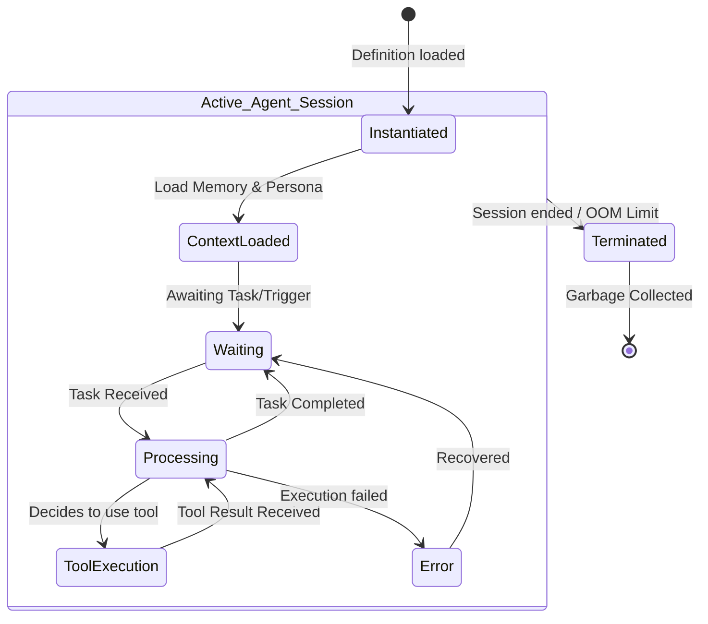

# Agent Lifecycle

Agents in Chhaya are ephemeral or persistent entities that execute tasks, utilize memory, and interact with the environment.

## Lifecycle Diagram

## Description

1. **Instantiation:** Agents are constructed based on a definition (e.g., standard ReAct agent, custom LangGraph workflow).
2. **Context Loading:** Before accepting tasks, the agent pulls its short-term and long-term memory context from the Memory Provider.
3. **Processing Loop:** The agent interacts with the LLM Provider to "think", executes actions via Tool Providers, and updates its internal state.
4. **Termination:** To conserve the strict hardware constraints (4GB VRAM), agents can be aggressively suspended or terminated. Their state is flushed to persistent memory, and the LLM context is unloaded from VRAM.