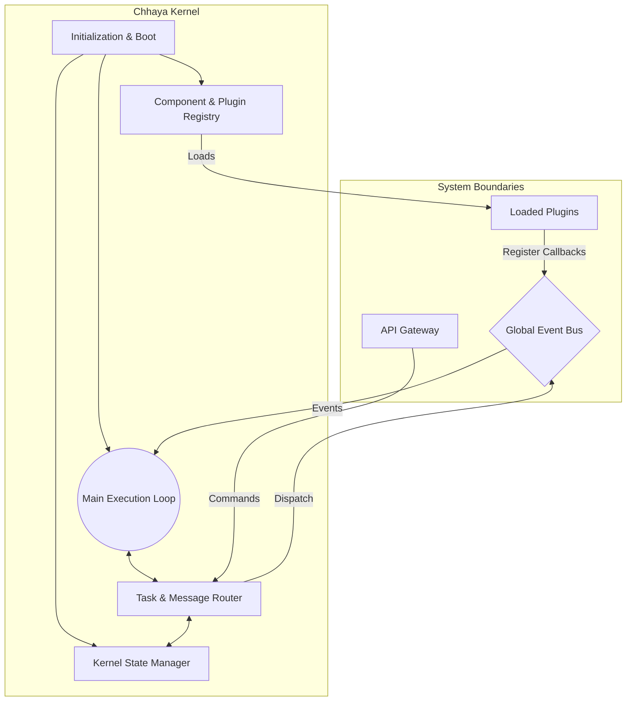

# Chhaya Kernel Architecture

The Chhaya Kernel is the central execution loop and state manager of the AI Operating System.

## Architecture Diagram

## Description

The Kernel is responsible for:
1. **Bootstrapping**: Initializing the configuration, loading the registry of available providers, and mounting plugins.
2. **State Management**: Keeping track of running agent sessions, memory limits, and overall system health.
3. **Execution Loop**: An asynchronous event loop that processes incoming commands from the API, dispatches them to the appropriate subsystem, and monitors the Event Bus for system-wide notifications.
4. **Routing**: Directing specific commands (e.g., "start agent", "query memory") to the appropriate internal packages.