# Chhaya Kernel Architecture

The Chhaya Kernel is designed to function as a true Operating System for AI agents, managing hardware constraints, process lifecycles, and asynchronous communication rather than acting as a simple message router.

## Architecture Diagram

```mermaid
graph TD
    subgraph "Hardware & Host OS"
        CPU[CPU / RAM Monitor]
        GPU[GPU / VRAM Monitor]
        Storage[Local File System]
    end

    subgraph "Chhaya Kernel (AI Operating System)"

        subgraph "Core Managers"
            BootMngr[Boot Manager]
            ShutdownMngr[Shutdown Manager]
            LifecycleMngr[Lifecycle Manager]
            ResourceMngr[Resource Manager]
            PermissionMngr[Permission Manager]
            Telemetry[Telemetry & Logging]
        end

        subgraph "Application Space"
            AgentMngr[Agent Manager]
            SessionMngr[Session Manager]
            TaskScheduler[Task Scheduler]
            PluginMngr[Plugin Manager]
        end

        subgraph "Abstractions & DI"
            DIContainer[DI Container]
            ProviderRegistry[Provider Registry]
        end

        %% The heart of the system
        EventBus{{Central Event Bus}}
    end

    subgraph "External Providers"
        LLMs[LLM Providers]
        MemDBs[Memory/Vector DBs]
        Tools[Tool Providers]
    end

    %% Hardware Constraints
    ResourceMngr -.->|Monitors| CPU
    ResourceMngr -.->|Monitors| GPU

    %% Boot and Shutdown
    BootMngr --> LifecycleMngr
    BootMngr --> DIContainer
    LifecycleMngr --> EventBus
    LifecycleMngr --> ShutdownMngr

    %% All subsystems communicate via Event Bus
    AgentMngr <--> EventBus
    SessionMngr <--> EventBus
    TaskScheduler <--> EventBus
    PluginMngr <--> EventBus
    ResourceMngr <--> EventBus
    PermissionMngr <--> EventBus
    Telemetry <--> EventBus

    %% DI and Registry
    DIContainer --> ProviderRegistry
    ProviderRegistry --> EventBus

    %% Provider Bindings
    ProviderRegistry -->|Binds Interface| LLMs
    ProviderRegistry -->|Binds Interface| MemDBs
    ProviderRegistry -->|Binds Interface| Tools
```

## Subsystem Responsibilities

1. **Boot Manager:** Initializes the Kernel environment, parses configuration, and starts the telemetry engine.
2. **Lifecycle Manager:** Controls the overall state of the OS (Booting, Running, Suspended, Shutting Down).
3. **Dependency Injection (DI) Container:** Handles dependency resolution and inversion of control for internal services.
4. **Resource Manager:** Actively monitors CPU, RAM, and VRAM usage. It triggers alerts if the 4GB VRAM constraint is breached, instructing the Agent Manager to suspend processes.
5. **Agent Manager:** Handles the instantiation, execution, and suspension of individual AI agents (analogous to Process Management in a traditional OS).
6. **Plugin Manager:** Discovers, validates, and mounts third-party extensions at runtime.
7. **Provider Registry:** Maintains the mapping between abstract interfaces (`LLMProvider`) and their concrete implementations (`OllamaProvider`).
8. **Task Scheduler:** Manages background tasks, cron-style jobs, and delayed agent executions.
9. **Session Manager:** Tracks active user interactions, correlating API requests with specific running agents and memory contexts.
10. **Permission Manager:** Enforces security boundaries, verifying if an agent is authorized to execute specific tools or access specific memory silos.
11. **Telemetry & Logging:** Provides structured observability, tracing agent thoughts and system health.
12. **Shutdown Manager:** Ensures graceful termination, flushing VRAM and saving agent states to disk before exit.
13. **Central Event Bus:** The primary communication backbone. Subsystems do not call each other directly; they publish and subscribe to strongly-typed asynchronous events.