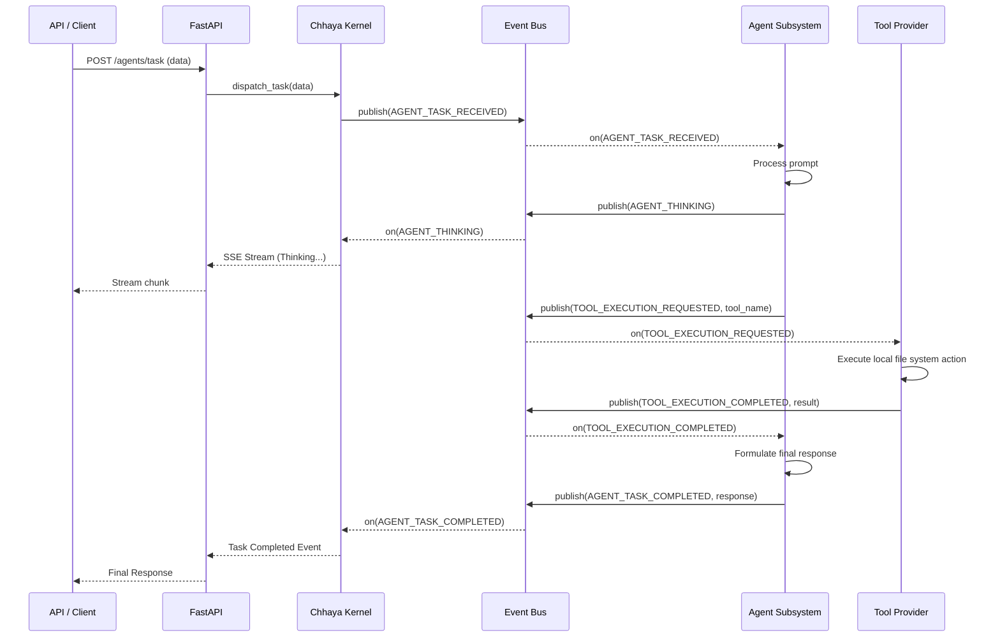

# Event Flow Architecture

The Chhaya Agent Factory utilizes an Event-Driven Architecture to prevent tight coupling between modules.

## Architecture Diagram

## Description

The Event Bus guarantees that subsystems do not need to know about each other's specific implementations.
- The Agent subsystem does not invoke a specific tool directly; it emits a `TOOL_EXECUTION_REQUESTED` event.
- The Tool orchestrator listens for that event, executes the action behind the provider interface, and emits the result.
- The Kernel observes all events and can stream them out to clients (via Server-Sent Events or WebSockets) for real-time UI updates in the web dashboard.