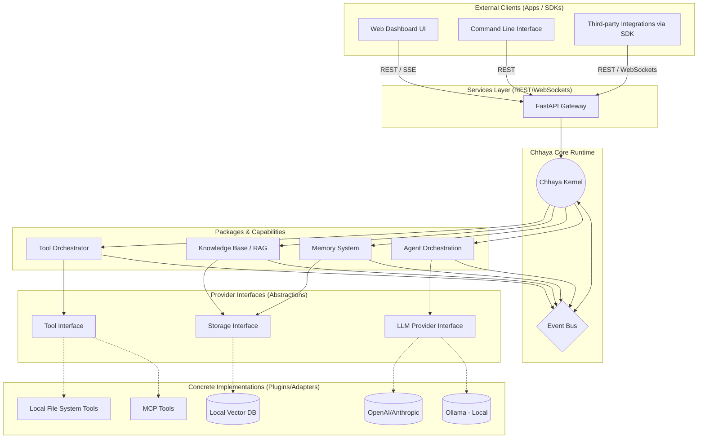

# High-Level System Architecture

This document outlines the high-level architecture of the Chhaya Agent Factory, illustrating how the major components interact to form an AI Operating System.

## Architecture Diagram

## Description

The architecture is designed strictly around the **Chhaya Kernel** which sits at the center of the system. Clients (like the Next.js Dashboard or CLI) never talk directly to agents or providers; they route through the FastAPI Service layer into the Kernel.

The Kernel communicates with major components (Agents, Memory, RAG, Tools) often asynchronously via the **Event Bus**.

Crucially, the core logic never interacts directly with concrete implementations like Ollama or a specific Vector DB. It strictly utilizes the **Provider Interfaces**. This allows the concrete implementations to be swapped seamlessly (e.g., swapping local Ollama for Cloud-based OpenAI) without altering the internal business logic.