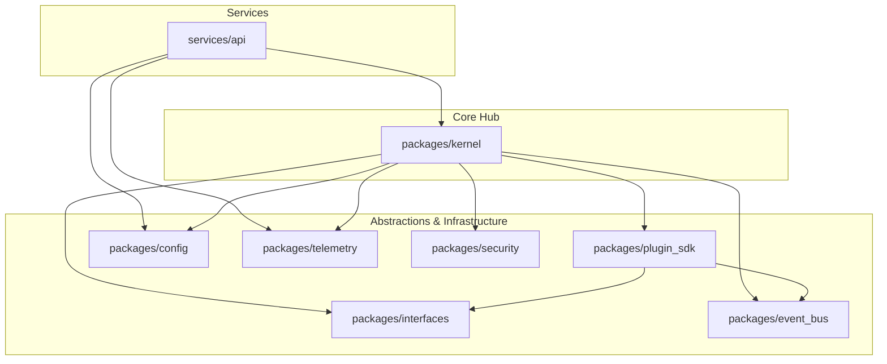

# Package Dependency Diagram

This diagram visualizes how the internal Monorepo packages depend on one another.

## Dependency Diagram

## Description

To maintain a clean architecture, dependencies must flow inwards toward the core abstractions:
1. **Zero-Dependency Packages:** Packages like `interfaces`, `event_bus`, `config`, and `telemetry` form the absolute base. They should not import from other internal packages.
2. **The Kernel:** The Kernel orchestrates the system, meaning it depends on almost all lower-level infrastructure packages.
3. **Services:** Standalone applications (like the FastAPI gateway) depend on the Kernel and configuration/telemetry, but should never bypass the Kernel to execute business logic directly.