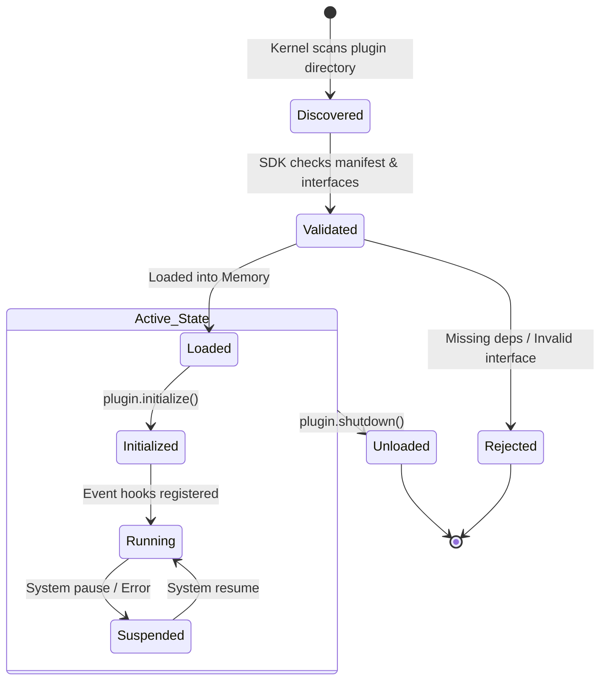

# Plugin Lifecycle

Plugins in Chhaya represent extensions, integrations, or new capabilities that are not part of the core runtime.

## Lifecycle Diagram

## Description

1. **Discovery:** Upon boot, the Kernel scans the `plugins/` directory and reads plugin manifests.
2. **Validation:** The Kernel uses the `plugin_sdk` to ensure the plugin implements the required abstract base classes and adheres to the version constraints.
3. **Initialization:** The plugin is instantiated, given access to the restricted Event Bus, and allowed to register its capabilities (e.g., registering a new LLM Provider or a new Tool).
4. **Shutdown:** During system termination or hot-reloading, plugins are gracefully unloaded to prevent memory leaks or orphaned processes.