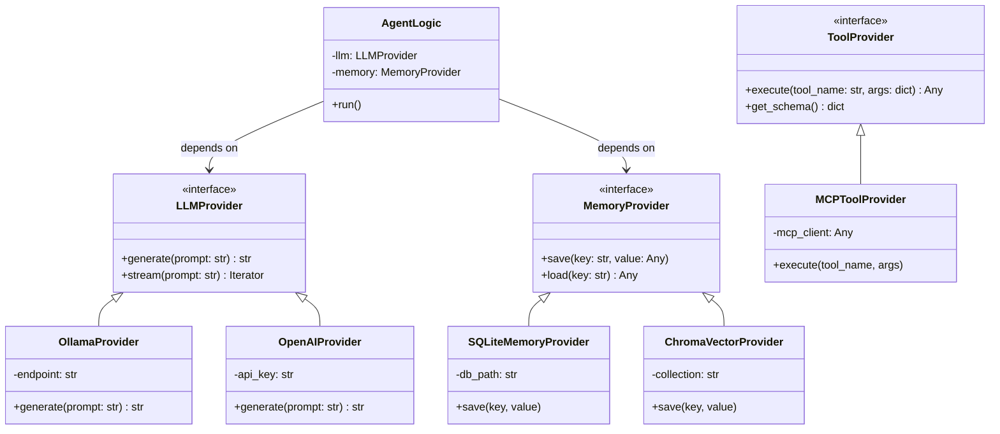

# Provider Abstraction Layer

The Provider Abstraction Layer (PAL) enforces dependency inversion. The core logic depends on abstract interfaces, never on concrete external libraries.

## Architecture Diagram

## Description

By ensuring `AgentLogic` only ever accepts instances of `LLMProvider` or `MemoryProvider`, Chhaya achieves:
1. **Testability:** Mock providers can be injected during testing.
2. **Extensibility:** A developer can add a `GeminiProvider` simply by implementing the `LLMProvider` protocol, without needing to change a single line of the core agent orchestration code.