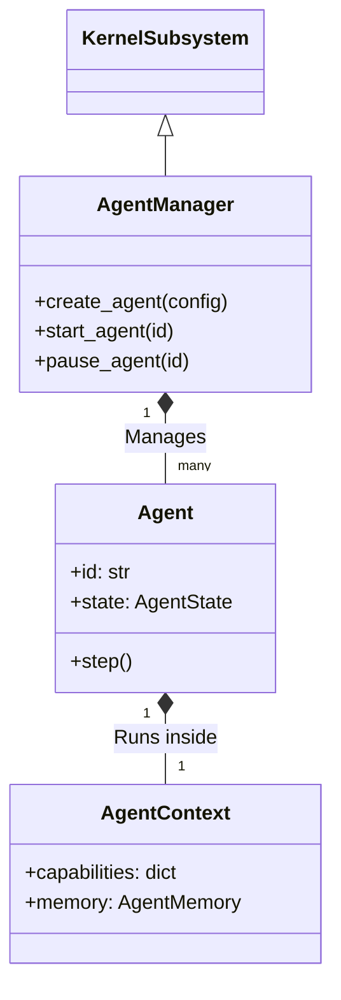
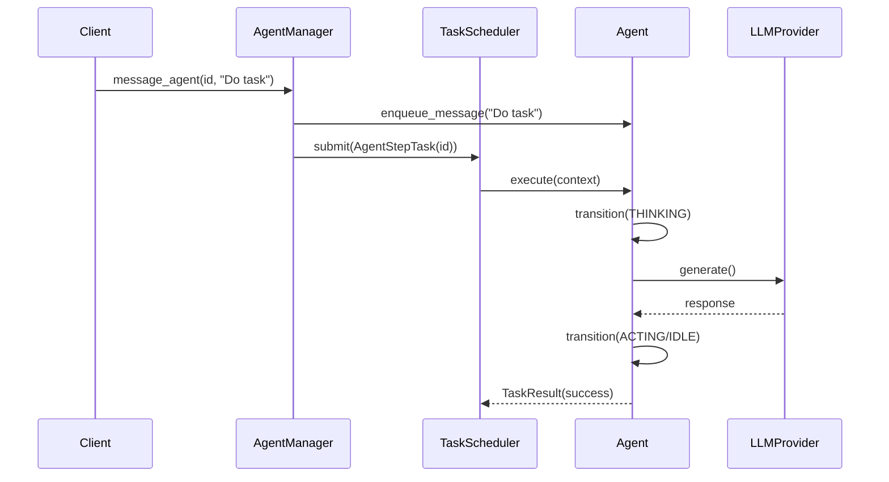
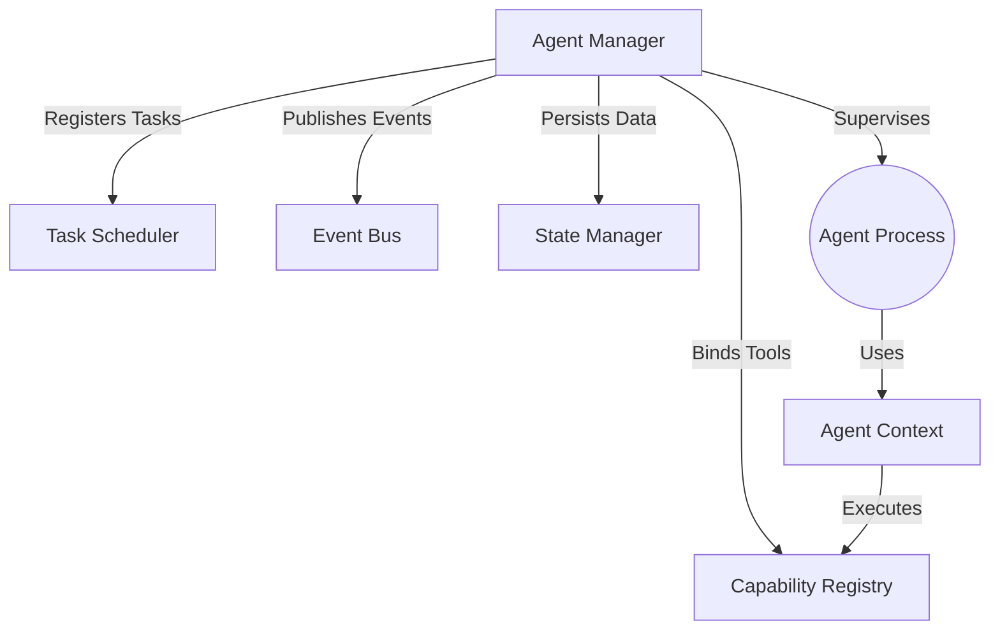

# Subsystem 10: Agent Runtime (Agent Manager) Design

## Executive Summary
The Agent Runtime (Agent Manager) is the cornerstone of the Chhaya OS. It elevates AI interactions from simple stateless request/response scripts into persistent, stateful, and autonomous processes. Acting as the process supervisor for AI entities, it is responsible for instantiating agents, managing their context windows, isolating their capabilities, orchestrating their asynchronous execution loops via the Task Scheduler, and monitoring their health.

## Responsibilities
- **Lifecycle Management:** Create, initialize, pause, resume, and terminate AI Agents.
- **State Tracking:** Maintain and transition agent states (e.g., IDLE, THINKING, ACTING, FAULTED).
- **Context Management:** Isolate memory, metadata, and capabilities for each agent.
- **Execution Orchestration:** Route agent actions through the `TaskScheduler` and `EventBus` without blocking the main OS thread.
- **Capability Binding:** Securely attach approved tools from the `CapabilityRegistry` to specific agents.

## Scope
### Goals
- Implement an OS-like process manager for Agents.
- Provide a framework-agnostic runtime that interacts with abstract LLM providers.
- Integrate deeply with Subsystems 1-9 (EventBus, StateManager, TaskScheduler, etc.).
- Ensure safety, isolation, and unhandled exception containment per agent.

### Non Goals
- Not implementing specific LLM API logic (that belongs in Provider plugins).
- Not implementing LangChain/LangGraph adapters natively within the core runtime (they will be implemented as external plugins).
- Not implementing UI components.

## Agent Lifecycle
Agents are managed entities with explicit lifecycles:
1. **Instantiation:** Created via configuration or API, registered with the Manager.
2. **Initialization:** Resources (Context, initial prompt, capabilities) are loaded.
3. **Execution Loop:** The agent alternates between polling memory, calling providers (`THINKING`), and executing capabilities (`ACTING`).
4. **Hibernation/Sleep:** If waiting for user input or scheduled delays, the agent suspends execution.
5. **Termination:** Graceful cleanup of resources.

## Agent State Machine
The Agent Runtime enforces a strict state machine to prevent race conditions:
*   `CREATED`: Instantiated but not yet initialized.
*   `INITIALIZED`: Context and capabilities bound; ready to run.
*   `IDLE`: Waiting for an objective or external trigger.
*   `THINKING`: Awaiting inference response from an LLM Provider.
*   `ACTING`: Executing a local capability/tool.
*   `AWAITING_INPUT`: Execution paused; requiring human-in-the-loop validation.
*   `SLEEPING`: Scheduled to wake up later (via TaskScheduler).
*   `FAULTED`: Unhandled error caught. Requires supervisor reset.
*   `TERMINATED`: Agent destroyed.

## Runtime Components
1. **AgentManager (KernelSubsystem):** The orchestrator tracking all live agents.
2. **Agent:** The primary entity interface containing identity and execution logic.
3. **AgentContext:** The isolated environment passed to the Agent containing contextual bounds.

## Context Management
`AgentContext` encapsulates:
- **Agent ID & Metadata:** Unique identity and persona configurations.
- **Memory Boundaries:** References to the `StateManager` partitioned specifically for this agent's history.
- **Capability Allowlist:** A restricted set of callable methods authorized for this specific agent.

## Subsystem Integrations
### StateManager Integration
Agent states, memory snapshots, and context checkpoints are continuously synced to the `StateManager`. This guarantees that if the Chhaya Kernel crashes, agents can resume mid-thought upon reboot.

### TaskScheduler Integration
Agent execution loops (`step()`) are never `await`ed directly by the Manager. They are wrapped in `Task` objects and submitted to the `TaskScheduler`. This offloads polling, handles timeout boundaries, and enables `SLEEPING` states via delayed triggers.

### EventBus Integration
Every state transition emits telemetry:
- `domain.agent.created`
- `domain.agent.state_changed`
- `domain.agent.faulted`
- `domain.agent.capability.executed`

### CapabilityRegistry Integration
During initialization, the Agent Manager queries the `CapabilityRegistry` to resolve string-based tool names (e.g., "fs.read", "web.search") into executable references, injecting them into the `AgentContext`.

### ProviderRegistry & Plugin Integration
The runtime queries the `ProviderRegistry` for interfaces like `ILLMProvider`. Plugins provide the actual model implementations (e.g., Ollama, OpenAI) seamlessly.

## Lifecycle Hooks
The `AgentManager` implements `KernelSubsystem`:
- `initialize()`: Sets up internal tracking dictionaries and subscribes to kernel shutdown events.
- `start()`: Prepares the supervisor loop.
- `stop()`: Signals all active agents to transition to a safe `STOPPING` state.
- `shutdown()`: Persists final snapshots and flushes active tasks.

## Error Recovery
- **Local Isolation:** Exceptions during an Agent's `step()` transition the specific agent to `FAULTED`.
- **Dead Letter Handling:** The TaskScheduler catches LLM timeouts, mapping them to agent faults, which allows the AgentManager to attempt automated recovery workflows (e.g., prompt downgrading or retry).

## Health Model
The Agent Manager reports health based on:
- Supervisor active status.
- Number of agents in `FAULTED` state versus `RUNNING`.
- Active queue length in the TaskScheduler.

## Public API (Draft)

```python
class AgentManager(KernelSubsystem):
    async def create_agent(self, config: AgentConfig) -> str: ...
    async def start_agent(self, agent_id: str) -> None: ...
    async def pause_agent(self, agent_id: str) -> None: ...
    async def get_agent_state(self, agent_id: str) -> AgentState: ...
    async def message_agent(self, agent_id: str, message: str) -> None: ...
```

## Mermaid Class Diagram



## Mermaid Sequence Diagram



## Mermaid Component Diagram



## Testing Strategy
- **Mock Providers:** Test state transitions using mocked `LLMProvider` instances to simulate immediate, delayed, and errored generations.
- **Fault Tolerance Validation:** Force exceptions inside capabilities to verify the agent enters the `FAULTED` state without crashing the `AgentManager`.
- **Event Emission Verification:** Subscribe a mock listener to the EventBus to verify all lifecycle transitions correctly broadcast.

## Future Distributed Runtime
By relying purely on the `EventBus` for inter-agent communication and the `StateManager` for persistence, this architecture guarantees that future iterations can migrate agents across distinct hardware nodes transparently.
