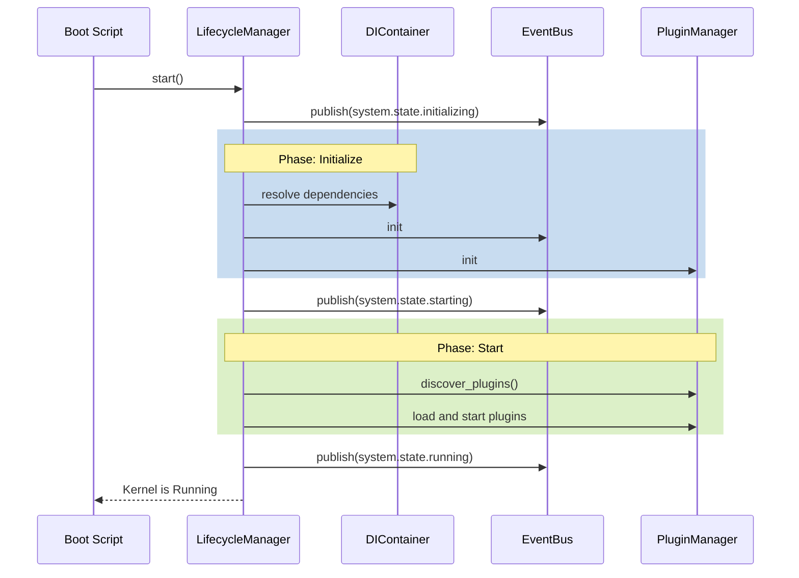
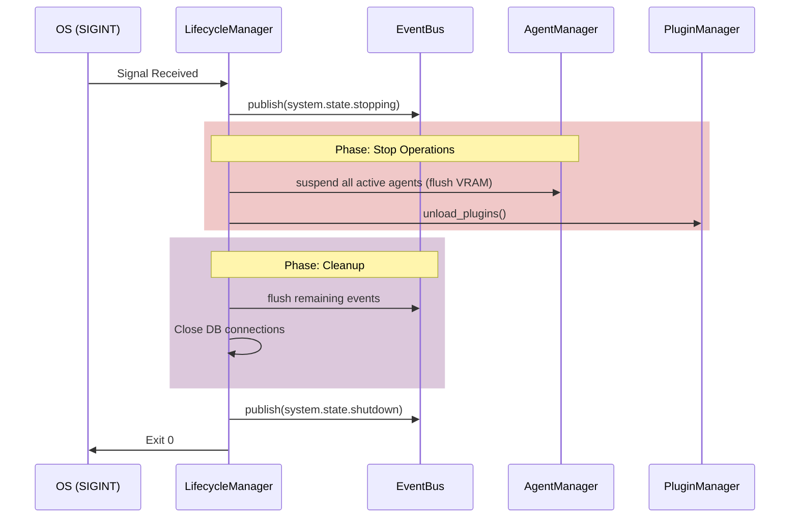
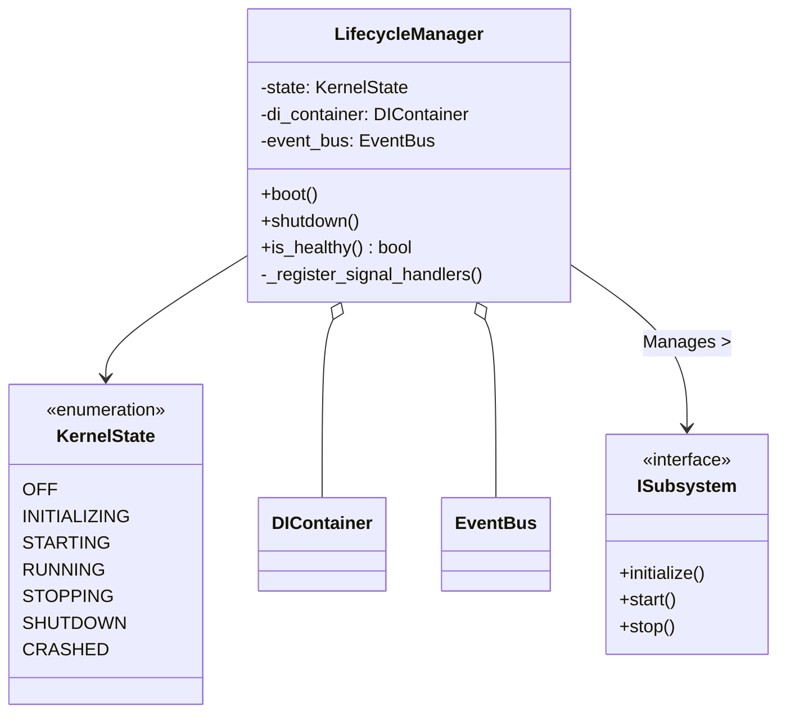

# Subsystem 6: Lifecycle Manager Design

## 1. Executive Summary
The Lifecycle Manager is the definitive state machine for the Chhaya Kernel. It ensures that the various OS subsystems (Config, EventBus, DI, PluginManager, AgentManager) boot in the correct topological order and shut down safely without corrupting data or leaving orphaned processes.

---

## 2. Responsibilities
1.  **State Machine:** Manage the overarching `KernelState` (`OFF`, `INITIALIZING`, `STARTING`, `RUNNING`, `STOPPING`, `SHUTDOWN`, `CRASHED`).
2.  **Dependency Ordering:** Ensure subsystems are initialized and started in a strictly enforced topological order.
3.  **Failure Handling:** Catch initialization failures, log critical errors, and transition safely to `CRASHED` or `SHUTDOWN`.
4.  **Graceful Shutdown:** Intercept OS signals (`SIGINT`, `SIGTERM`), halt new traffic, notify running agents to suspend, and close database connections.
5.  **Health Checks:** Expose an API for external readiness/liveness probes (useful for Kubernetes or local watchdogs).
6.  **Event Orchestration:** Publish lifecycle events to the `EventBus` so plugins and subsystems can react to system state changes.

---

## 3. Integrations

### 3.1 DI Integration
The Lifecycle Manager is instantiated early and registered into the `DIContainer` as a `SINGLETON`. It resolves other subsystems out of the DI container to invoke their lifecycle methods.

### 3.2 EventBus Integration
The Lifecycle Manager strictly publishes its state transitions:
*   `system.state.initializing`
*   `system.state.starting`
*   `system.state.running`
*   `system.state.stopping`
*   `system.state.shutdown`

### 3.3 PluginManager Integration
During the `STARTING` phase, the Lifecycle Manager instructs the `PluginManager` to execute the `discover_plugins()` and `load_plugin()` sequences. Plugins are only initialized after core kernel managers are online.

---

## 4. Lifecycle States & Ordering

### 4.1 Dependency Ordering
The boot sequence must strictly follow this order:
1.  **Level 0:** ConfigManager, Telemetry
2.  **Level 1:** DIContainer, EventBus
3.  **Level 2:** ProviderRegistry, PluginManager
4.  **Level 3:** Database/Storage Connections
5.  **Level 4:** AgentManager, TaskScheduler, API Gateway

### 4.2 Sequences

**Boot Sequence (Startup)**


**Graceful Shutdown Sequence**


---

## 5. Failure Handling & Graceful Shutdown
*   **Initialization Failures:** If a core subsystem fails during the `INITIALIZING` or `STARTING` phase (e.g., missing API key, DB offline), the `LifecycleManager` catches the exception, logs a `CRITICAL` error, publishes `system.state.crashed`, and immediately triggers the `STOPPING` sequence for any subsystems that *did* manage to start.
*   **Graceful Shutdown:** The `LifecycleManager` binds to Python's `signal.signal(signal.SIGINT, ...)` to capture termination requests. It allows a configurable timeout (e.g., 10 seconds) for agents to serialize state before forcing a hard exit.

---

## 6. Public API Proposal

```python
class KernelState(Enum):
    OFF = "off"
    INITIALIZING = "initializing"
    STARTING = "starting"
    RUNNING = "running"
    STOPPING = "stopping"
    SHUTDOWN = "shutdown"
    CRASHED = "crashed"

class LifecycleManager:
    @property
    def state(self) -> KernelState: ...

    def is_healthy(self) -> bool:
        """Returns True if state is RUNNING and core subsystems are responsive."""
        ...

    async def boot(self) -> None:
        """Executes INITIALIZING and STARTING sequences, transitioning to RUNNING."""
        ...

    async def shutdown(self) -> None:
        """Executes STOPPING sequence, transitioning to SHUTDOWN."""
        ...
```

---

## 7. Class Diagram



---

## 8. Unit Testing Strategy
1.  **State Transitions:** Test that `boot()` moves the state linearly from `OFF` -> `INITIALIZING` -> `STARTING` -> `RUNNING`.
2.  **Event Emitting:** Use a mock `EventBus` to verify that `system.state.*` events are emitted precisely between state boundaries.
3.  **Failure Recovery:** Inject a failing mock subsystem. Assert that `boot()` throws an exception, the state moves to `CRASHED`, and the `stop()` method is called on any successful mock subsystems to prevent resource leaks.
4.  **Signal Handling:** Simulate `SIGINT` and verify that `shutdown()` is invoked automatically.

---

## 9. Future Extensibility
*   **Dependency DAG:** In Phase 1, boot order will likely be hardcoded arrays (`self._init_order = [...]`). In Phase 3, this can be refactored into a dependency graph (DAG) where subsystems declare what they rely on, and the manager topologically sorts the boot order dynamically.
*   **Health API:** The `is_healthy()` endpoint will eventually aggregate health checks from the Provider Registry (e.g., pinging Ollama) to support advanced load-balancer readiness probes.