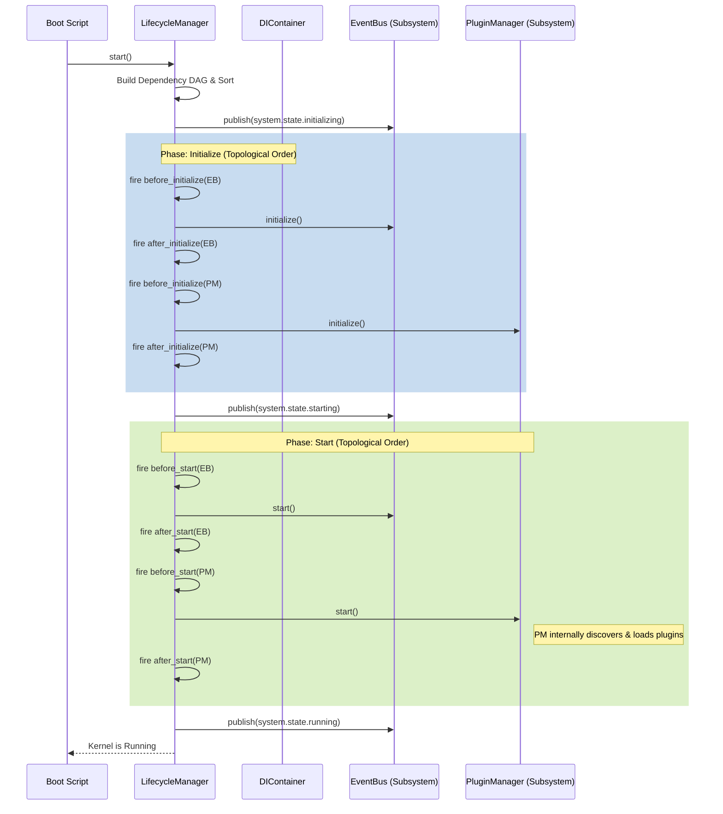
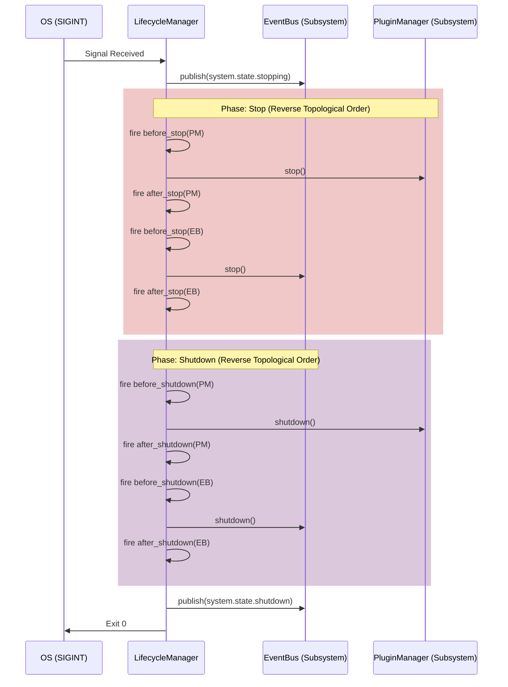
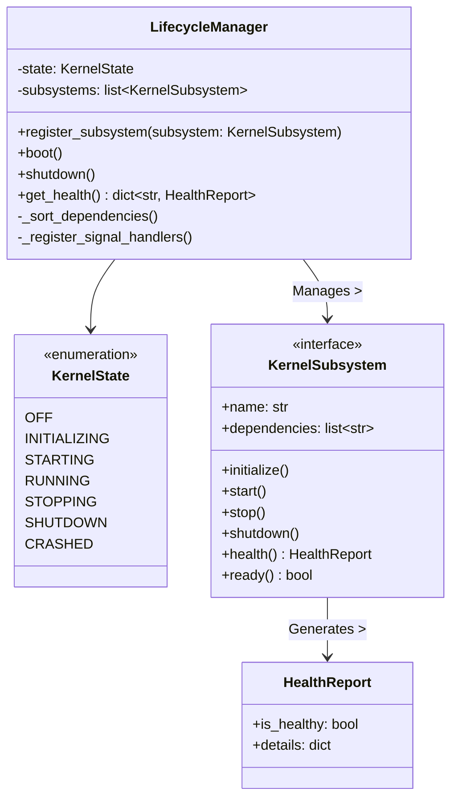

# Subsystem 6: Lifecycle Manager Design

## 1. Executive Summary
The Lifecycle Manager is the definitive state machine for the Chhaya Kernel. It ensures that the various OS subsystems (Config, EventBus, DI, PluginManager, AgentManager) boot in the correct topological order and shut down safely without corrupting data or leaving orphaned processes.

---

## 2. Responsibilities
1.  **State Machine:** Manage the overarching `KernelState` (`OFF`, `INITIALIZING`, `STARTING`, `RUNNING`, `STOPPING`, `SHUTDOWN`, `CRASHED`).
2.  **Dependency Ordering:** Ensure subsystems are initialized and started using a topological dependency model rather than hardcoded sequence levels.
3.  **Failure Handling:** Catch initialization failures, log critical errors, and transition safely to `CRASHED` or `SHUTDOWN`.
4.  **Graceful Shutdown:** Intercept OS signals (`SIGINT`, `SIGTERM`), halt new traffic, notify running agents to suspend, and close database connections.
5.  **Health Checks:** Expose a rich `HealthReport` API for external readiness/liveness probes.
6.  **Event Orchestration:** Publish lifecycle events to the `EventBus` so plugins and subsystems can react to system state changes.

---

## 3. The `KernelSubsystem` Protocol
To decouple the Lifecycle Manager from specific subsystem implementations, every managed subsystem must implement the `KernelSubsystem` protocol.

```python
from typing import Protocol, List

class HealthReport:
    is_healthy: bool
    details: dict[str, str]

class KernelSubsystem(Protocol):
    @property
    def name(self) -> str: ...

    @property
    def dependencies(self) -> List[str]:
        """Returns a list of subsystem names this subsystem depends on."""
        ...

    async def initialize(self) -> None: ...
    async def start(self) -> None: ...
    async def stop(self) -> None: ...
    async def shutdown(self) -> None: ...

    async def health(self) -> HealthReport: ...
    def ready(self) -> bool: ...
```

---

## 4. Integrations

### 4.1 DI Integration
The Lifecycle Manager is instantiated early and registered into the `DIContainer` as a `SINGLETON`. It resolves instances of `KernelSubsystem` out of the DI container to invoke their lifecycle methods.

### 4.2 EventBus Integration
The Lifecycle Manager strictly publishes its state transitions:
*   `system.state.initializing`
*   `system.state.starting`
*   `system.state.running`
*   `system.state.stopping`
*   `system.state.shutdown`

### 4.3 PluginManager Integration
The `PluginManager` is treated exactly like any other `KernelSubsystem`. The Lifecycle Manager will call `PluginManager.initialize()` and `PluginManager.start()`. It will **not** invoke specific methods like `discover_plugins()` or `load_plugin()`; the PluginManager is responsible for orchestrating its own internal behavior during those phases.

---

## 5. Lifecycle States & Ordering

### 5.1 Dependency Ordering (Topological Sort)
Subsystems declare their dependencies via the `dependencies` property. The Lifecycle Manager builds a Directed Acyclic Graph (DAG) of all registered `KernelSubsystem` instances and performs a topological sort.

During `boot()`, subsystems are `initialize()`'d and `start()`'ed in topological order (dependencies first). During `shutdown()`, they are `stop()`'ped and `shutdown()`'ed in **reverse** topological order.

### 5.2 Sequences

**Boot Sequence (Startup)**


**Graceful Shutdown Sequence**


---

## 6. Failure Handling & Graceful Shutdown
*   **Initialization Failures:** If a core subsystem fails during the `INITIALIZING` or `STARTING` phase, the `LifecycleManager` catches the exception, logs a `CRITICAL` error, publishes `system.state.crashed`, and immediately triggers the `STOPPING` sequence in reverse topological order for any subsystems that *did* manage to start.
*   **Graceful Shutdown:** The `LifecycleManager` binds to Python's `signal.signal(signal.SIGINT, ...)` and `SIGTERM`. It allows a configurable timeout for subsystems to flush state before forcing a hard exit.

---

## 7. Public API Proposal

```python
class KernelState(Enum):
    OFF = "off"
    INITIALIZING = "initializing"
    STARTING = "starting"
    RUNNING = "running"
    STOPPING = "stopping"
    SHUTDOWN = "shutdown"
    CRASHED = "crashed"

class LifecycleManager:
    @property
    def state(self) -> KernelState: ...

    def register_subsystem(self, subsystem: KernelSubsystem) -> None: ...

    async def get_health(self) -> dict[str, HealthReport]:
        """Returns the aggregated health reports from all subsystems."""
        ...

    async def boot(self) -> None:
        """Executes INITIALIZING and STARTING sequences, transitioning to RUNNING."""
        ...

    async def shutdown(self) -> None:
        """Executes STOPPING and SHUTDOWN sequences, transitioning to SHUTDOWN."""
        ...
```

---

## 8. Class Diagram



---

## 9. Unit Testing Strategy
1.  **State Transitions:** Test that `boot()` moves the state linearly from `OFF` -> `INITIALIZING` -> `STARTING` -> `RUNNING`.
2.  **Topological Sorting:** Register Mock subsystems with complex dependency graphs (e.g., A depends on B, B depends on C) and verify that `initialize()` and `start()` are called on C, then B, then A. Verify `stop()` is called in A, B, C order.
3.  **Circular Dependencies:** Verify that registering subsystems with a circular dependency graph throws an immediate structural error during the sort phase before any initialization begins.
4.  **Failure Recovery:** Inject a failing mock subsystem. Assert that `boot()` throws an exception, the state moves to `CRASHED`, and the `stop()` method is called on any successful mock subsystems to prevent resource leaks.
5.  **Signal Handling:** Simulate `SIGINT` and verify that `shutdown()` is invoked automatically.

---

## 10. Future Extensibility
*   **Telemetry Integration:** The `before_` and `after_` lifecycle hooks provided internally by the LifecycleManager will eventually be bound to the `Telemetry` system, providing precise timing logs for how long each subsystem takes to boot and shut down.
*   **Kubernetes Probes:** The `get_health()` endpoint returning `HealthReport` objects makes it trivial to expose a `/healthz` REST endpoint in the future that correctly aggregates hardware stats (VRAM usage) and connection states (DB online/offline).
