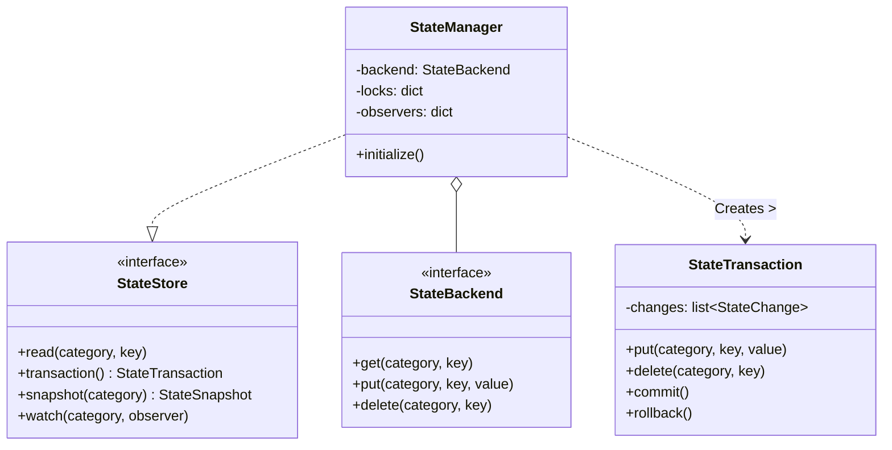
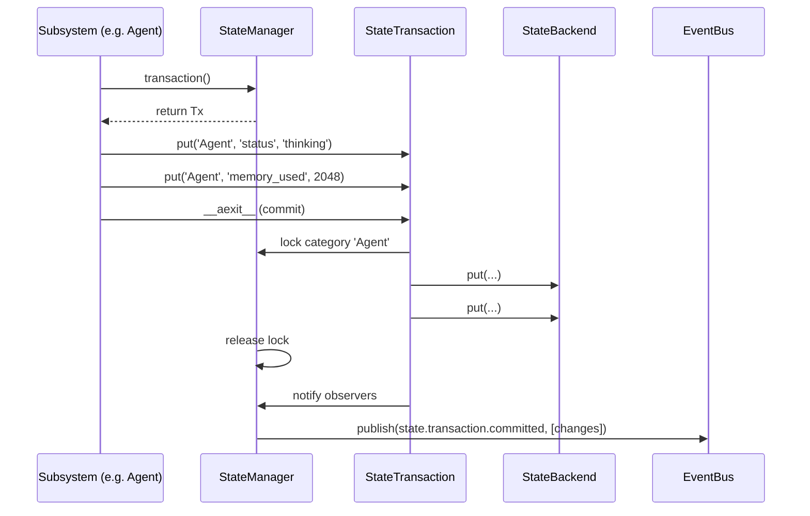
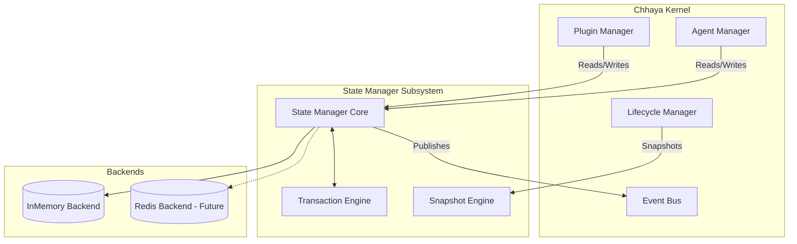

# Subsystem 8: State Manager Design

## 1. Executive Summary
The State Manager acts as the central, asynchronous, transaction-safe data store for all operational state within the Chhaya Kernel. It isolates state by domain categories, abstracts the underlying storage mechanism, and provides a robust event-driven model to track mutations, snapshots, and recovery.

## 2. Scope & Responsibilities

### Responsibilities
*   **Centralized Storage:** Act as the single source of truth for all ephemeral and persistent kernel state.
*   **Concurrency Control:** Provide async-safe locking and transaction models to prevent race conditions.
*   **Storage Abstraction:** Map high-level state operations to underlying `StateBackend` implementations.
*   **Observability:** Emit `EventBus` events and trigger `StateObserver` callbacks upon mutations.
*   **Snapshotting:** Generate serializable point-in-time snapshots for recovery and VRAM swapping.

### Scope
The State Manager covers operational, configuration, and short-term workflow state.

### Non-Goals
*   **Long-Term Semantic Memory:** The State Manager does *not* replace the RAG `MemoryProvider` (Vector DBs). It does not store huge corpuses of document embeddings.
*   **Log Storage:** It is not a replacement for Telemetry/Logging.

---

## 3. State Categories
To prevent namespace collisions, state is strictly partitioned into:
1.  **Kernel State:** Global OS state, active subsystems, boot levels.
2.  **Agent State:** Active agent statuses, tool loop iterations, temporary scratchpads.
3.  **Session State:** User interaction context, auth tokens, UI correlation IDs.
4.  **Workflow State:** Multi-agent LangGraph-style execution graphs and checkpoints.
5.  **Plugin State:** Plugin lifecycles, manifests, and runtime flags.
6.  **Provider State:** Health status, rate-limit tracking, active connections.
7.  **Capability State:** Mappings of available tools/actions.

---

## 4. Architecture Core Components

*   **`StateStore`**: The primary interface for subsystems to interact with state.
*   **`StateBackend`**: The abstract protocol dictating how state is actually stored (e.g., InMemory, Redis).
*   **`StateSnapshot`**: An immutable, deep-copied, serializable representation of a state tree at a given timestamp.
*   **`StateChange`**: A delta record describing a specific mutation (Create, Update, Delete) for auditing and eventing.
*   **`StateTransaction`**: A context manager that batches `StateChange`s. It ensures atomicity (all-or-nothing) and holds necessary async locks.
*   **`StateObserver`**: A synchronous callback interface for high-performance internal reactivity (bypassing the async EventBus overhead).
*   **`StateSerializer`**: Handles converting complex Python objects into JSON-safe dicts for the `StateBackend`.

---

## 5. Interface Definitions

```python
from typing import Protocol, Any, Sequence
from dataclasses import dataclass

@dataclass
class StateChange:
    category: str
    key: str
    old_value: Any
    new_value: Any
    action: str # "CREATE", "UPDATE", "DELETE"

class StateObserver(Protocol):
    def on_state_change(self, change: StateChange) -> None: ...

class StateBackend(Protocol):
    async def get(self, category: str, key: str) -> Any: ...
    async def put(self, category: str, key: str, value: Any) -> None: ...
    async def delete(self, category: str, key: str) -> None: ...
    async def clear_category(self, category: str) -> None: ...

class StateStore(Protocol):
    async def read(self, category: str, key: str) -> Any: ...
    def transaction(self) -> 'StateTransaction': ...
    def watch(self, category: str, observer: StateObserver) -> None: ...
    async def snapshot(self, category: str) -> 'StateSnapshot': ...
```

---

## 6. Strategies

### 6.1 Storage Strategy
For Phase 1, the `StateBackend` will be implemented as a purely in-memory dictionary. The abstraction guarantees that swapping to a persistent backend (e.g., SQLite or Redis) in later phases requires zero changes to the Kernel subsystems.

### 6.2 Concurrency Strategy
*   **Async-Safe:** The `StateStore` utilizes `asyncio.Lock` mapped per-category to prevent dirty reads.
*   **Transaction Model:** A `StateTransaction` acquires the lock upon entry, queues all `put` and `delete` operations in memory, and only commits them to the `StateBackend` upon successful exit. If an exception occurs inside the context block, the transaction is discarded (rollback).
*   **Read/Write Locking:** Phase 1 uses standard exclusive locks. Future phases may introduce `asyncio` Readers-Writer locks if read contention becomes a bottleneck.

### 6.3 Snapshot Strategy
Snapshots are triggered manually before an Agent is suspended (due to the 4GB VRAM constraint). The `StateStore` generates a `StateSnapshot` (a deep copy of the category), which the `LifecycleManager` or `AgentManager` can serialize to disk via the `StateSerializer`.

### 6.4 Recovery Strategy
Upon kernel boot, the `LifecycleManager` instructs the `StateManager` to initialize. If a persistent backend is attached, the `StateManager` restores the exact state tree. Orphaned transactions from prior crashes are naturally discarded as they were never committed.

---

## 7. Lifecycle & EventBus Integration
The State Manager implements the `KernelSubsystem` protocol.

**Published Events:**
*   `state.changed.started`: Emitted when a transaction opens.
*   `state.changed.completed`: Emitted for individual, non-transactional mutations.
*   `state.transaction.committed`: Emitted when a batch of changes is successfully written. Payload contains the list of `StateChange`s.
*   `state.snapshot.created`: Emitted when a snapshot is successfully generated.

---

## 8. Mermaid Diagrams

### 8.1 Class Diagram


### 8.2 Sequence Diagram: Transactional Update


### 8.3 Component Diagram


---

## 9. Public API Proposal

```python
# Standard usage
store = di.resolve(StateStore)

# Simple read
status = await store.read("Agent", "agent_123_status")

# Transactional update
async with store.transaction() as tx:
    await tx.put("Agent", "agent_123_status", "thinking")
    await tx.put("Agent", "agent_123_tokens", 400)
    # Automatically committed at end of block, or rolled back if exception occurs

# Snapshot generation
snapshot = await store.snapshot("Session")
serialize_to_disk(snapshot)
```

---

## 10. Unit Testing Strategy
1.  **Isolation:** Test `StateBackend` implementations entirely separately from the `StateManager` orchestration.
2.  **Concurrency:** Use `asyncio.gather` to launch 100 simultaneous concurrent writes to the same key inside and outside of transactions, verifying that `asyncio.Lock` successfully prevents data races.
3.  **Rollback:** Inside an `async with transaction():` block, raise an exception, and assert the `StateBackend` was not mutated.
4.  **Observer/Event Hooks:** Verify that registered `StateObserver` callbacks and `EventBus` publications are fired exactly once per commit with accurate `StateChange` records.

---

## 11. Future Extensibility
*   **Distributed State:** The `StateBackend` protocol is perfectly poised to integrate with Redis. By changing a single line in the `DIContainer` registration, the entire Chhaya OS becomes multi-node capable.
*   **CRDTs:** For high-throughput collaborative agent workflows, the `StateBackend` can be expanded to support Conflict-free Replicated Data Types natively without changing the `StateStore` API.
