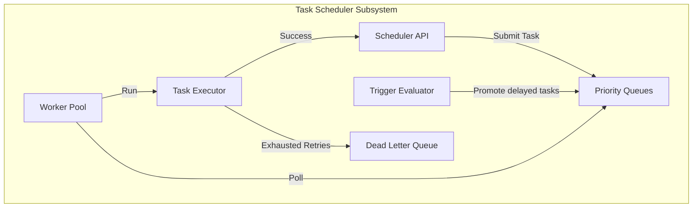
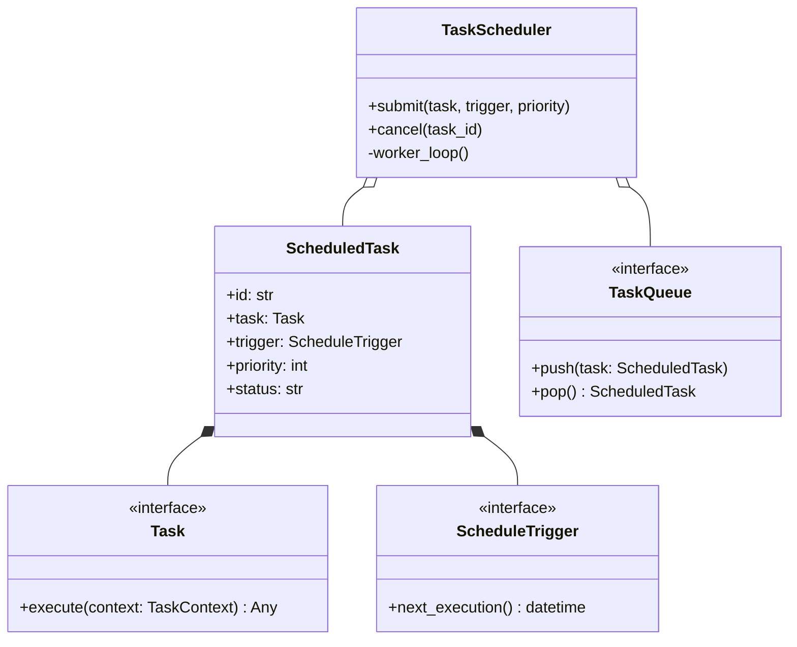
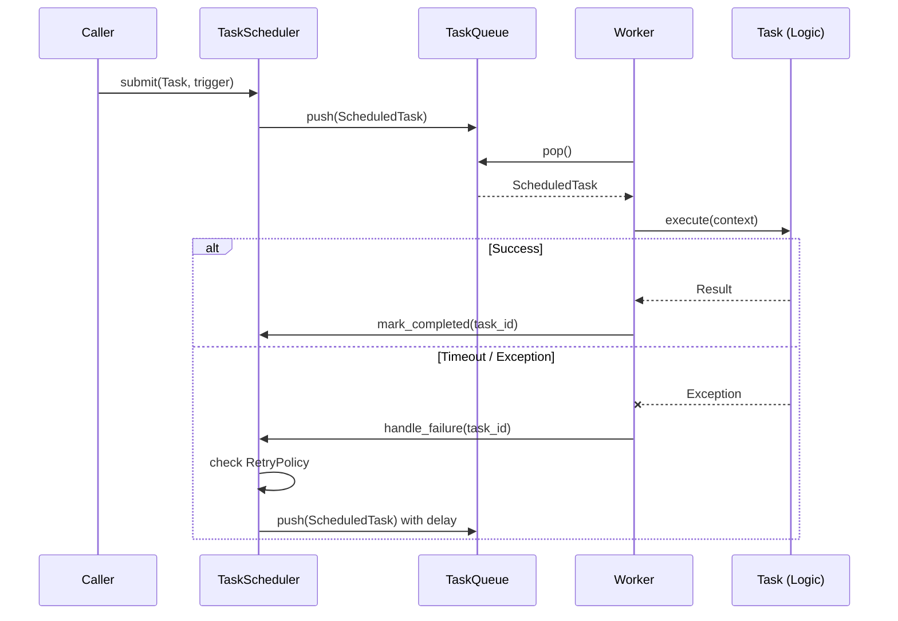

# Subsystem 9: Task Scheduler Design

## 1. Executive Summary
The Task Scheduler is the asynchronous execution engine of the Chhaya Kernel. It is responsible for orchestrating delayed, recurring, and dependent background jobs (Tasks). It enforces priority queues, concurrency limits, and retry policies, providing a distributed-ready foundation for complex, long-running Agent workflows.

## 2. Responsibilities
*   **Job Ingestion:** Accept definitions of work with specific execution triggers.
*   **Queue Management:** Route tasks into priority-based queues.
*   **Execution:** Safely run task logic within a bounded worker pool.
*   **Resilience:** Handle timeouts, apply retry policies, and route irrevocably failed tasks to a Dead Letter Queue (DLQ).
*   **Graph Resolution:** Ensure tasks with explicit dependencies execute in the correct topological order.

## 3. Goals
*   **Clean Architecture:** The scheduler must be completely agnostic to the actual business logic of the tasks it runs.
*   **Local-First, Distributed-Ready:** The Phase 1 implementation must run in-memory, but the architecture must allow swapping to a persistent message broker (like Redis) seamlessly.
*   **Observability:** Emit standard EventBus events for every task lifecycle transition.

## 4. Non-Goals
*   **Replacing the EventBus:** The EventBus handles immediate, broadcast pub/sub routing. The Task Scheduler handles point-to-point, durable, scheduled work execution.
*   **Implementing Distributed Transports:** Redis or Celery integration is a non-goal for Phase 1.

---

## 5. Architecture & Core Models

### 5.1 `Task`
A protocol defining the unit of work. It exposes a single asynchronous `execute(context: TaskContext)` method.

### 5.2 `ScheduledTask`
A metadata wrapper around a `Task`. Contains the task ID, assigned trigger, priority, retry policy, and current status (`PENDING`, `RUNNING`, `COMPLETED`, `FAILED`, `CANCELLED`).

### 5.3 `TaskContext`
An object injected into the `Task.execute()` method, providing access to the `DIContainer`, `EventBus`, `StateManager`, and the task's own ID/attempt count.

### 5.4 `TaskResult`
The outcome of a `Task.execute()`, containing either the return value or the caught Exception.

### 5.5 `TaskQueue` (Protocol)
The abstraction for pushing and popping `ScheduledTask` items based on priority.

### 5.6 `TaskExecutor` (Protocol)
The worker abstraction responsible for safely running a `Task` and returning a `TaskResult`.

### 5.7 `RetryPolicy`
Configuration dictating how failures are handled:
*   `max_attempts`: int
*   `backoff_strategy`: "linear" | "exponential"
*   `base_delay_seconds`: float

---

## 6. Scheduling Triggers

### 6.1 `ScheduleTrigger` (Base Protocol)
Calculates the next valid execution time.

### 6.2 `OneShotTrigger`
Executes exactly once, either immediately or after a specific delay/timestamp.

### 6.3 `IntervalTrigger`
Executes repeatedly with a fixed time interval (e.g., every 5 seconds).

### 6.4 `CronTrigger`
Executes based on standard Unix cron expressions (e.g., `0 * * * *` for hourly).

---

## 7. Execution Engine

### 7.1 Priority Levels
The `TaskQueue` must support multiple priority bands:
*   `CRITICAL`: System maintenance (e.g., VRAM flush).
*   `HIGH`: Interactive user requests.
*   `DEFAULT`: Standard background processing.
*   `LOW`: Batch indexing, log rotation.

### 7.2 Dependency Graph
A `ScheduledTask` can list other task IDs as dependencies. The Scheduler will hold the task in a `WAITING` state until all prerequisite tasks reach the `COMPLETED` state.

### 7.3 Worker Pool & Concurrency Model
The Kernel will initialize a fixed-size async worker pool (e.g., 10 concurrent workers). Workers continuously poll the highest-priority available queue. This prevents the event loop from being starved by an infinite influx of background tasks.

### 7.4 Execution Pipeline
1.  Scheduler evaluates triggers and moves tasks to the Ready Queue.
2.  Worker pops Task, updates state to `RUNNING`.
3.  Worker invokes `TaskExecutor`.
4.  Worker evaluates `TaskResult`. Moves to `COMPLETED`, schedules a retry, or moves to DLQ.

---

## 8. Resilience & Recovery

### 8.1 Cancellation / Pause / Resume
*   **Cancellation:** Active tasks can be cancelled via an `asyncio.Event` flag in the `TaskContext`. Pending tasks are simply removed from the queue.
*   **Pause/Resume:** The entire Scheduler subsystem can be paused by the `LifecycleManager` during shutdown.

### 8.2 Failure Recovery & Dead Letter Queue
If a task exhausts its `RetryPolicy`, it is marked as `FAILED` and moved to a Dead Letter Queue (DLQ). The DLQ allows administrators to inspect failed payloads and manually requeue them later.

### 8.3 Timeout Handling
Every `ScheduledTask` has a `timeout_seconds` limit. The `TaskExecutor` wraps execution in `asyncio.wait_for`. If triggered, it counts as a failure and increments the retry counter.

---

## 9. Integrations

### 9.1 Lifecycle Integration
Inherits `KernelSubsystem`.
*   `initialize()`: Sets up the internal queues.
*   `start()`: Spins up the background worker pool tasks.
*   `stop()`: Stops pulling new tasks, waits for active tasks to finish or timeout.

### 9.2 EventBus Integration
Publishes strictly formatted events:
*   `task.scheduled.completed`
*   `task.execution.started`
*   `task.execution.completed`
*   `task.execution.failed`
*   `task.cancelled.completed`

### 9.3 State Manager Integration
Task definitions, dependency graphs, and queue states are persisted to the `StateManager` under the `WORKFLOW` category to survive unexpected crashes.

### 9.4 Capability & Provider Integration
Future capabilities (e.g., sending emails via a Provider) will be executed by wrapping them in generic `Task` instances and submitting them to this Scheduler.

### 9.5 Plugin Integration
Plugins can register new `Task` definitions or custom `ScheduleTrigger` logic dynamically.

### 9.6 Metrics & Health Reporting
The `health()` method returns `HealthReport` containing:
*   Active worker count.
*   Queue depths (Pending, DLQ).
*   Error rates.

---

## 10. Persistence Strategy
For Phase 1, the `TaskQueue` is in-memory (`asyncio.PriorityQueue`). However, because the queue state is mirrored to the `StateManager`, the system retains a basic crash-recovery mechanism assuming the State Manager's backend is eventually persistent.

---

## 11. Mermaid Diagrams

### 11.1 Component Diagram


### 11.2 Class Diagram


### 11.3 Sequence Diagram: Execution & Retry


---

## 12. Public API Proposal

```python
class TaskScheduler(KernelSubsystem):
    async def submit(
        self,
        task: Task,
        trigger: ScheduleTrigger | None = None,
        priority: int = 100,
        dependencies: list[str] | None = None
    ) -> str:
        """Submits a task, returns the tracking ID."""
        ...

    async def cancel(self, task_id: str) -> None:
        """Cancels a pending or running task."""
        ...

    async def get_status(self, task_id: str) -> str:
        """Returns the current state of a task."""
        ...
```

---

## 13. Unit Testing Strategy
*   **Trigger Logic:** Test Cron, Interval, and OneShot triggers to ensure accurate `next_execution()` math.
*   **Priority Enforcements:** Push multiple tasks with different priorities simultaneously; assert the worker pops them in the correct order.
*   **Retry & DLQ:** Inject a mock task that fails exactly 3 times. Verify it executes 3 times, emits failure events, and lands in the DLQ.
*   **Dependencies:** Submit Task A depending on Task B. Complete Task B manually and verify Task A is subsequently promoted to the execution queue.
*   **Timeouts:** Configure a task with a 0.1s timeout that sleeps for 1s. Verify the timeout triggers and handles safely.

---

## 14. Future Distributed Scheduler
The strict separation of `TaskQueue` and `TaskExecutor` interfaces means that in Phase X, we can inject a `RedisTaskQueue`. Multiple instances of the Chhaya Kernel running on different laptops can connect to the same Redis instance, transforming the single-process Worker Pool into a horizontally scalable distributed execution cluster without modifying a single line of the agent's logic.
